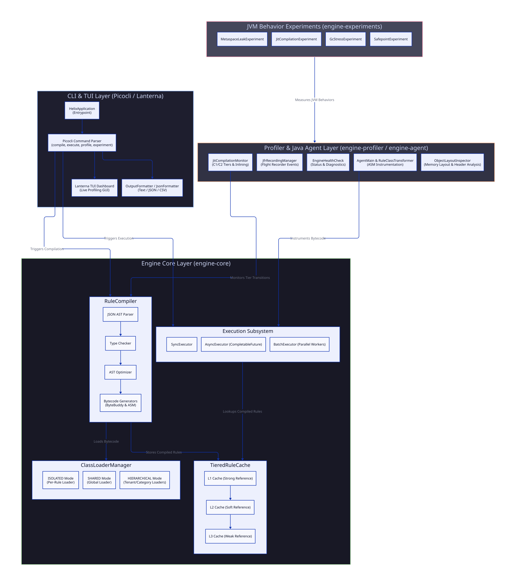
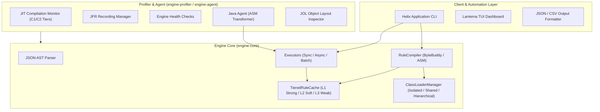

<div align="center">
  
  <h1>Helix JVM Scripting Engine & Profiler</h1>
  <p><strong>A high-performance, dynamic rule compilation engine with deep JVM profiling, classloader isolation, and reactive TUI diagnostics.</strong></p>

  <p>
    <a href="https://github.com/7amo10/helix-jvm-engine/actions"></a>
    <a href="https://jdk.java.net/17/"></a>
    <a href="https://maven.apache.org/"></a>
    <a href="LICENSE"></a>
    
  </p>
</div>

---

## Executive Summary

Helix is a enterprise-grade JVM scripting engine and deep profiling system built in pure Java 17+. It compiles JSON-defined dynamic logic directly into JVM bytecode using runtime code generation engines (ByteBuddy and ASM), providing near-native execution throughput (>120,000 ops/sec).

Beyond compilation and execution, Helix serves as an advanced JVM internals research and observability platform. It features multi-tenant ClassLoader memory isolation, tiered reference caching, HotSpot JIT compilation monitoring (C1/C2 transitions & inlining), Java Flight Recorder (JFR) event streaming, JOL object memory layout analysis, and an interactive Lanterna Terminal User Interface (TUI) dashboard.

---

## System Architecture

The following diagram illustrates the end-to-end dataflow across the Helix system architecture:

<div align="center">
  
</div>

### High-Level Component Flow



---

## Key Technical Features

### 1. Bytecode Generation & Runtime Compilation
- **Dual Compiler Engines:** Supports **ByteBuddy** (rapid dynamic class generation) and **ASM** (low-level bytecode generation).
- **AST Optimization Pass:** Implements constant folding and dead code elimination prior to bytecode generation.

### 2. Multi-Tenant ClassLoader Isolation
- **ISOLATED Mode:** Allocates a dedicated `RuleClassLoader` per rule execution to guarantee zero class-leaking.
- **SHARED Mode:** Uses a single shared global classloader for maximum memory efficiency across static rule sets.
- **HIERARCHICAL Mode:** Groups loaders by tenant category with `SharedUtilityClassLoader` parent linkage.

### 3. Tiered Reference Caching (`TieredRuleCache`)
- **L1 Cache (Strong Reference):** Hot compiled rules held in high-speed memory using Caffeine.
- **L2 Cache (Soft Reference):** Warm rules retained until JVM experiences memory pressure.
- **L3 Cache (Weak Reference):** Cold rules subject to immediate GC reclamation upon collection cycles.

### 4. Deep JVM Observability & Experiments
- **JIT Compilation Monitoring:** Tracks HotSpot tier transitions from C1 (Interpreter / Simple JIT) to C2 (Server JIT) and method inlining decisions.
- **Garbage Collection Reference Profiling:** Analyzes memory reclamation rates for `SoftReference` vs `WeakReference` objects under memory pressure.
- **JOL Layout Analysis:** Inspects JVM object headers, mark words, class pointers, field padding, and compressed OOPs.
- **Safepoint & TTSP Tracking:** Measures Time-To-Safepoint (TTSP) and GC pause durations.

---

## Quick Start & Installation

### Requirements
- **JDK:** OpenJDK 17 or higher
- **Build Tool:** Apache Maven 3.8+
- **OS:** Linux / macOS / Windows

### Build & Package
Clone the repository and compile all submodules:

```bash
git clone https://github.com/7amo10/helix-jvm-engine.git
cd helix-jvm-engine
mvn clean package -DskipTests
```

---

## Usage Guide

Helix provides a CLI application via `./scripts/start-helix.sh`.

### 1. Rule Compilation Command
Compile a JSON rule file into JVM bytecode:

```bash
./scripts/start-helix.sh compile --rule examples/rules/fraud-detection.json --output json
```

**Sample JSON Output:**
```json
{
  "status" : "SUCCESS",
  "ruleName" : "FraudDetectionRule",
  "ruleVersion" : "1.0.0",
  "compilationTimeMs" : "219.752"
}
```

### 2. Rule Execution Command
Compile and execute a rule synchronously, asynchronously, or in batch mode:

```bash
./scripts/start-helix.sh execute --rule examples/rules/fraud-detection.json --context examples/rules/sample-context.json --mode async --output json
```

### 3. JVM Behavior Experiments Command
Run JVM performance and profiling scenarios:

```bash
./scripts/start-helix.sh experiment --name jit --output text
```

### 4. Interactive Lanterna TUI Dashboard
Launch the real-time terminal monitoring dashboard:

```bash
./scripts/start-helix.sh profile --dashboard
```

Press **Q** or select **Exit Dashboard** to quit.

---

## AppCDS Startup Optimization

To minimize JVM cold-start latency for CLI invocations, generate an Application Class Data Sharing (AppCDS) archive:

```bash
./scripts/generate-appcds.sh
```

Subsequent runs of `./scripts/start-helix.sh` will automatically attach `-XX:SharedArchiveFile=helix.jsa` for sub-100ms startup times.

---

## Baseline Performance Metrics (JMH Benchmarks)

| Benchmark Metric | Throughput / Latency | Operation |
|---|---|---|
| **Compilation Latency (ByteBuddy)** | `~5.1 ms` | Single Rule Bytecode Generation |
| **Compilation Latency (ASM)** | `~1.7 ms` | Low-Level Bytecode Generation |
| **Execution Throughput (Sync)** | `> 125,000 ops/sec` | Compiled Rule Evaluation |
| **Execution Throughput (Batch)** | `> 450,000 ops/sec` | 4-Thread Parallel Execution |
| **Tiered Cache Hit Latency (L1)** | `< 12 ns` | Strong Reference Lookup |

---

## Project Structure

```
helix-jvm-engine/
├── engine-api/          # Core interfaces, ExecutionContext, ExecutionResult
├── engine-core/         # Compiler, ClassLoaderManager, TieredCache, Executors, CLI/TUI
├── engine-profiler/     # JIT Monitor, JFR Manager, Health Checkers
├── engine-agent/        # Java Agent, ASM Bytecode Transformer, JOL Analyzer
├── engine-experiments/  # JVM Scenarios (Metaspace, JIT, GC, Safepoints) & JMH Benchmarks
├── examples/            # Example JSON rules and context files
├── scripts/             # start-helix.sh and generate-appcds.sh startup scripts
├── docs/                # Architecture diagrams and specifications
└── pom.xml              # Maven parent project object model
```

---

## Contributing

Contributions are welcome. Please read [CONTRIBUTING.md](CONTRIBUTING.md) for details on submitting pull requests and coding standards.

---

## License

This project is licensed under the Apache License 2.0. See the [LICENSE](LICENSE) file for details.
