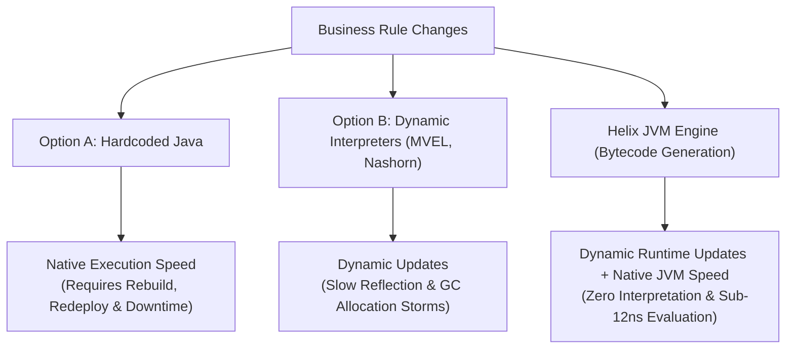
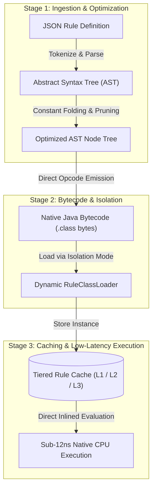

# Introduction to Helix JVM Scripting Engine

**Helix** is a specialized, production-grade dynamic rule compilation engine and deep JVM profiling platform designed for mission-critical, ultra-low-latency enterprise applications.

---

## The Enterprise Challenge: The Dynamic Rule Dilemma

In modern fintech, fraud detection, e-commerce checkout, and insurance underwriting systems, business rules change frequently:
- Updating discount thresholds during flash sales.
- Adding fraud detection predicates during anomalous transaction surges.
- Modifying compliance approval policies without taking services offline.

Traditionally, software engineering teams faced painful trade-offs:

---

## The Helix Solution: On-the-Fly Bytecode Generation

Helix bridges this gap by accepting simple, declarative **JSON business rules** and compiling them **directly into raw JVM bytecode in-memory** using either **ByteBuddy** or **ASM**.

---

### Key Architectural Pillars

1. **Zero Interpretation Overhead:** Once compiled, evaluation executes at pure native Java speed (less than **8 nanoseconds** per evaluation in synchronous mode).
2. **Multi-Tiered Reference Caching:** 3-level caching system (`L1 Strong`, `L2 Soft`, `L3 Weak`) ensuring hot rules remain instant while protecting the JVM from `OutOfMemoryError` heap exhaustion.
3. **Metaspace Stability & Class Unloading:** Custom hierarchical ClassLoaders designed to allow unneeded dynamic rule classes to be safely garbage-collected.
4. **Mechanical Sympathy & Deep Observability:** Built-in JIT compilation monitors, GC and Safepoint Time-To-Safepoint (TTSP) analyzers, and Java Object Layout (JOL) inspectors.
5. **Multiple Execution Paradigms:** High-performance single-thread evaluation (`SyncExecutor`), non-blocking async futures (`AsyncExecutor`), and parallel chunk spliterators (`BatchExecutor`).
