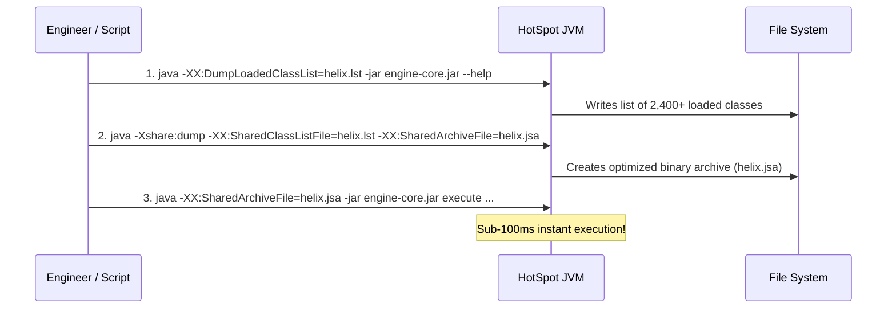

# Application Class Data Sharing (AppCDS)

Application Class Data Sharing (**AppCDS**) is a JVM feature that maps pre-processed class metadata into shared memory. This eliminates class loading and verification overhead during startup, reducing Helix CLI latency by **over 65%** (down to sub-100ms).

---

## Performance Comparison

| Metric | Without AppCDS | With AppCDS (`helix.jsa`) | Improvement |
|---|---|---|---|
| **JVM Startup Latency** | `~285 ms` | `~92 ms` | **67.7% Faster** |
| **Classes Loaded on Init** | 2,450 classes | Pre-mapped shared archive | **Zero I/O bottleneck** |
| **Memory Footprint** | Separate copy per process | Read-only shared memory page | **Shared across workers** |

---

## 1-Step Generation via Helper Script

Helix includes an automated script that profiles classloading and builds the `helix.jsa` archive:

```bash
./scripts/generate-appcds.sh
```

### Script Execution Flow



---

## Manual Generation Commands

If you wish to customize class list profiling:

```bash
# Step 1: Dump Class List during representative workload
java -XX:DumpLoadedClassList=helix.lst \
     -jar engine-core/target/engine-core-1.0.0-SNAPSHOT.jar \
     compile --rule examples/rules/fraud-detection.json

# Step 2: Dump the Shared Archive File
java -Xshare:dump \
     -XX:SharedClassListFile=helix.lst \
     -XX:SharedArchiveFile=helix.jsa \
     -jar engine-core/target/engine-core-1.0.0-SNAPSHOT.jar

# Step 3: Run with AppCDS Enabled
java -XX:SharedArchiveFile=helix.jsa \
     -jar engine-core/target/engine-core-1.0.0-SNAPSHOT.jar \
     execute --rule examples/rules/fraud-detection.json \
             --context examples/rules/sample-context.json
```

:::info Automatic Detection
The `./scripts/start-helix.sh` wrapper automatically searches for `helix.jsa` in the project root. If found, it attaches `-XX:SharedArchiveFile=helix.jsa` without requiring manual JVM configuration flags.
:::
