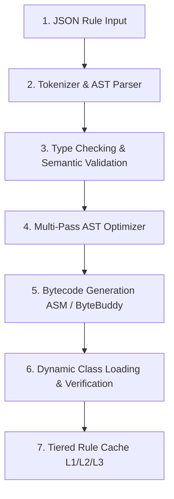
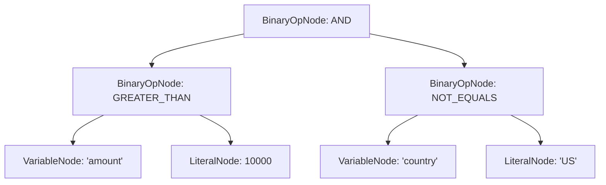

# Dynamic Compilation Pipeline

Helix compiles declarative rule definitions into executable JVM bytecode using a 5-stage compilation lifecycle:



---

## 1. Native Recursive-Descent Lexer & Operator-Precedence AST Parser

Helix features a zero-dependency lexical analyzer and operator-precedence parser (`AstBuilder`) built directly into `engine-core`. Unlike legacy engines that rely on external expression interpreters or reflection-heavy runtimes, Helix tokenizes infix expressions into a strict stream of typed tokens (`IDENTIFIER`, `LITERAL`, `BINARY_OP`, `LOGICAL_OP`, `PAREN`) and constructs the Abstract Syntax Tree using Dijkstra's shunting-yard and precedence climbing.

For example, the expression:
```java
amount > 10000 && country != "US"
```
is parsed into the following strongly-typed node tree:



---

## 2. Type Checking & Semantic Validation

Before generating bytecode, the `TypeChecker` verifies that:
1. Every referenced variable in the expression exists in the `inputSchema`.
2. Operands have compatible types (e.g. comparing `int` with `int`, `double` with `double`, or `String` with `String`).
3. Logical operations (`&&`, `||`, `!`) operate exclusively on boolean expressions.
4. Division by zero on literal constants is caught at compile-time before bytecode emission.

---

## 3. Multi-Pass AST Optimization

The `AstOptimizer` runs iterative passes until tree convergence:
- **Constant Folding:** Expressions like `10 + 20 > 5` are computed at compile-time to `true`.
- **Dead Code Elimination:** Branches like `false && (x > 100)` are reduced to literal `false`.
- **Identity Simplification:** Expressions like `x && true` reduce to `x`.
- **Algebraic Reductions:** Operations like `x * 0` or `x + 0` are simplified to zero or `x`.

---

## 4. Bytecode Generation & ClassLoader Emission

The optimized AST is transformed into raw bytecode implementing the `CompiledRule` interface:

```java
package com.helix.generated;

import com.helix.api.CompiledRule;
import com.helix.api.ExecutionContext;

public class FraudDetectionRule_v1 implements CompiledRule {
    @Override
    public boolean eval(ExecutionContext ctx) {
        int amount = ctx.getInt("amount");
        String country = ctx.getString("country");
        return (amount > 10000) && (!"US".equals(country));
    }
}
```

The resulting `.class` bytes are dynamically injected into an isolated `RuleClassLoader` instance, ready for instant invocation.

---

## 5. Non-Intrusive Dynamic Debug Probing & Disassembly

During development or active diagnosis, the compiled bytecode can be instrumented on-the-fly without changing the original source rule:
- **`DebugClassVisitor`:** Uses ASM method adapters to inject non-intrusive probe callbacks (`DebugProbe`) at bytecode entry, branching points, and exit.
- **`FrameInspector`:** Captures the operand stack and local variable slots (`amount`, `country`) without halting the JVM thread.
- **Bytecode Disassembler:** Decompiles generated `.class` byte arrays into human-readable Java bytecode opcodes directly in the CLI (`helix repl` `:disasm`), allowing engineers to verify JIT inlining friendliness and stack depth.
