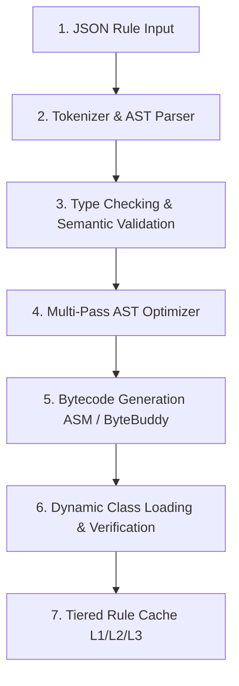
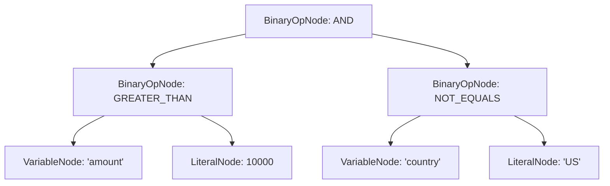

# Dynamic Compilation Pipeline

Helix compiles declarative rule definitions into executable JVM bytecode using a 5-stage compilation lifecycle:



---

## 1. JSON Rule Parsing to AST

The parser receives a JSON rule and constructs an in-memory Abstract Syntax Tree (AST). For example, the expression:
```java
amount > 10000 && country != "US"
```
is parsed into the following node tree:



---

## 2. Type Checking & Semantic Validation

Before generating bytecode, the `TypeChecker` verifies that:
1. Every referenced variable in the expression exists in the `inputSchema`.
2. Operands have compatible types (e.g. comparing `int` with `int`, `double` with `double`, or `String` with `String`).
3. Logical operations (`&&`, `||`, `!`) operate exclusively on boolean expressions.

---

## 3. Multi-Pass AST Optimization

The `BytecodeOptimizer` runs iterative passes until tree convergence:
- **Constant Folding:** Expressions like `10 + 20 > 5` are computed at compile-time to `true`.
- **Dead Code Elimination:** Branches like `false && (x > 100)` are reduced to literal `false`.
- **Identity Simplification:** Expressions like `x && true` reduce to `x`.

---

## 4. Bytecode Generation & ClassLoader Emission

The optimized AST is transformed into raw bytecode implementing the `CompiledRule` interface:

```java
package com.helix.generated;

import com.helix.api.CompiledRule;
import com.helix.api.ExecutionContext;

public class FraudDetectionRule_v1 implements CompiledRule {
    @Override
    public boolean eval(ExecutionContext ctx) {
        int amount = ctx.getInt("amount");
        String country = ctx.getString("country");
        return (amount > 10000) && (!"US".equals(country));
    }
}
```

The resulting `.class` bytes are dynamically injected into a isolated `RuleClassLoader` instance, ready for instant invocation.
