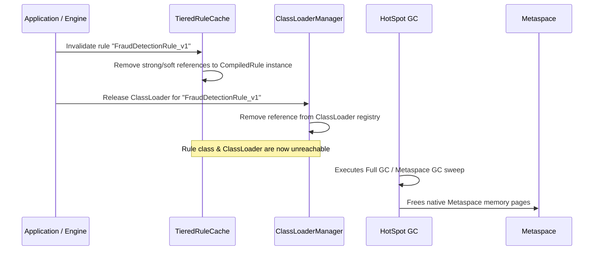

import ClassLoaderHierarchySvg from '@site/static/img/diagrams/classloader-hierarchy.svg';

# ClassLoader Hierarchy & Metaspace Safety

In JVM applications that compile classes on the fly, careless classloading is the primary cause of Metaspace memory leaks (`java.lang.OutOfMemoryError: Metaspace`). A class can only be unloaded if and only if its defining `ClassLoader` is no longer reachable from any GC root.

---

## ClassLoader Tree Structure

Helix organizes dynamic ClassLoaders into a dedicated hierarchical model managed by `ClassLoaderManager`:

  <ClassLoaderHierarchySvg style={{maxWidth: '100%', height: 'auto', borderRadius: '8px'}} />

---

## Isolation Modes

Helix supports 3 isolation modes configured via `IsolationMode`:

| Isolation Mode | Architecture | Metaspace Characteristics | Recommended Use Case |
|---|---|---|---|
| **`ISOLATED`** | 1 unique `RuleClassLoader` per compiled rule. | Maximum isolation. Discarding the rule ClassLoader instantly unloads the single class. | Production multi-tenant services with dynamic rules. |
| **`HIERARCHICAL`** | Namespaced grouping (e.g. `Finance`, `Retail`). Rules in the same namespace share a parent loader. | Balanced. Common utility classes are shared; tenant namespaces can be flushed together. | Enterprise microservices with clear domain partitions. |
| **`SHARED_UTILITY`** | Common parent loader for shared helper functions; individual leaf loaders for rules. | Minimizes class duplication across rules. | High-volume single-tenant rule workloads. |

---

## Dynamic Class Unloading Lifecycle

To safely evict and reclaim Metaspace when a rule is updated or deleted:

:::warning Avoiding Metaspace Leaks
Never store a direct reference to a dynamically loaded `Class<?>` or `ClassLoader` in a `static` field or long-lived `ThreadLocal`, as this will pin the ClassLoader and prevent HotSpot from reclaiming Metaspace.
:::
