# ML Inference & Adaptive Optimization Architecture

This document describes the complete architecture of the two embedded ONNX models that power
Phase 3 of the Helix engine: inline production fraud detection via `fraud_model_v1.onnx` and
neural-guided AST reordering via `ast_reorder_policy.onnx`. Both models operate entirely within
the JVM process heap with no external network calls, remote endpoints, or serialization overhead.

---

## 1. Two-Model System Overview

Helix embeds two ONNX models serving fundamentally different roles in the execution pipeline.
One model produces business-level fraud decisions. The other optimizes the engine's own execution
strategy at runtime.

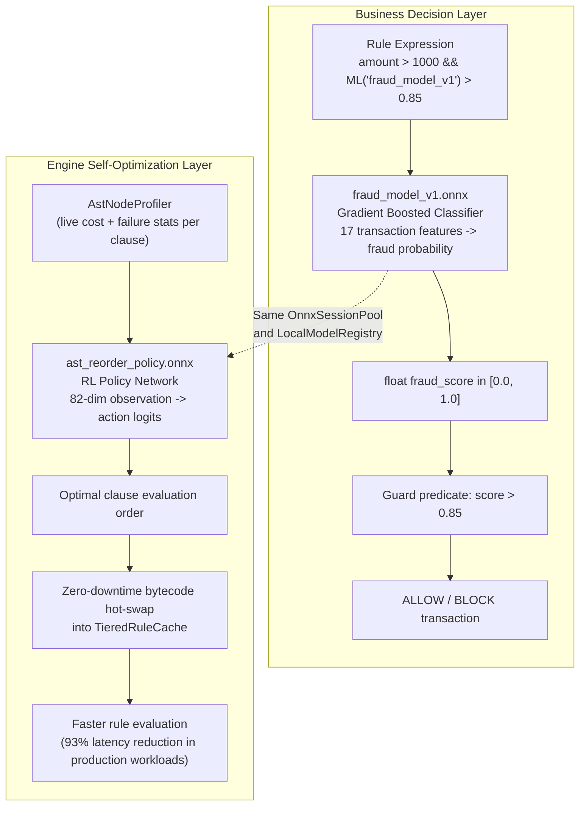

---

## 2. Model 1: `fraud_model_v1.onnx` - Production Fraud Classifier

### 2.1 Purpose and Use Case

`fraud_model_v1` is a production-grade binary transaction classifier trained on 17 behavioral and
contextual features extracted from payment transaction metadata. Its output — a scalar fraud
probability in `[0.0, 1.0]` — participates as a first-class operand in Helix boolean rule
expressions, enabling data scientists to deploy ML-powered fraud guards without writing any Java.

**Representative use cases:**
- High-value payment transaction screening (`amount > 1000 && ML('fraud_model_v1') > 0.85`)
- Multi-signal risk scoring combining device, velocity, and geographic features
- Chargeback prevention by combining historical signals with real-time inference

### 2.2 Input Feature Schema

The model consumes exactly 17 float features extracted in this fixed order from the `ExecutionContext`:

| Index | Feature Name | Type | Description |
|---|---|---|---|
| 0 | `amount` | `float` | Transaction amount in base currency units |
| 1 | `hour_of_day` | `float` | Hour of transaction (0-23, UTC) |
| 2 | `day_of_week` | `float` | Day of week (0=Mon, 6=Sun) |
| 3 | `merchant_category` | `float` | Merchant category code (encoded integer) |
| 4 | `transaction_currency` | `float` | ISO currency code (encoded integer) |
| 5 | `velocity_1h` | `float` | Transaction count in last 1 hour |
| 6 | `velocity_24h` | `float` | Transaction count in last 24 hours |
| 7 | `velocity_7d` | `float` | Transaction count in last 7 days |
| 8 | `amount_deviation_30d` | `float` | Z-score deviation from 30-day mean amount |
| 9 | `unique_merchants_24h` | `float` | Distinct merchant count in last 24 hours |
| 10 | `is_new_device` | `float` | 1.0 if device seen for first time, else 0.0 |
| 11 | `device_risk_score` | `float` | Device fingerprint risk score (0.0-1.0) |
| 12 | `is_vpn_or_proxy` | `float` | 1.0 if VPN or proxy IP detected, else 0.0 |
| 13 | `country_mismatch` | `float` | 1.0 if IP country differs from billing country |
| 14 | `account_age_days` | `float` | Days since account creation |
| 15 | `is_account_suspended` | `float` | 1.0 if account has active suspension flag |
| 16 | `previous_chargeback` | `float` | 1.0 if account has prior chargeback history |

### 2.3 Model Architecture and Inference Path

```mermaid
flowchart LR
    subgraph InputPrep["Feature Preparation (OnnxFeatureExtractor)"]
        Context["ExecutionContext\nMap<String, Object>"] --> Align["Feature order alignment\n(OnnxModelDescriptor.inputFeatures)"]
        Align --> Coerce["Type coercion\ndouble/int/bool -> float"]
        Coerce --> FVec["float[17] feature vector"]
        FVec --> Tensor["OnnxTensor shape [1, 17]\n(single-row batch)"]
    end

    subgraph ModelInference["ONNX Runtime Inference (native JNI)"]
        Tensor --> Input["input: float_input [1, 17]"]
        Input --> GBM["Gradient Boosting\nor MLP layers"]
        GBM --> Softmax["Softmax activation"]
        Softmax --> Output["output: probabilities [1, 2]\n[p_benign, p_fraud]"]
    end

    subgraph OutputExtraction["Result Extraction"]
        Output --> Extract["outputIndex=1\n(positive class: fraud)"]
        Extract --> Score["float fraud_probability\ne.g. 0.9237"]
        Score --> Compare["Rule predicate\nscore > 0.85"]
        Compare --> Boolean["boolean: true (BLOCK)"]
    end
```

### 2.4 ONNX Graph Topology

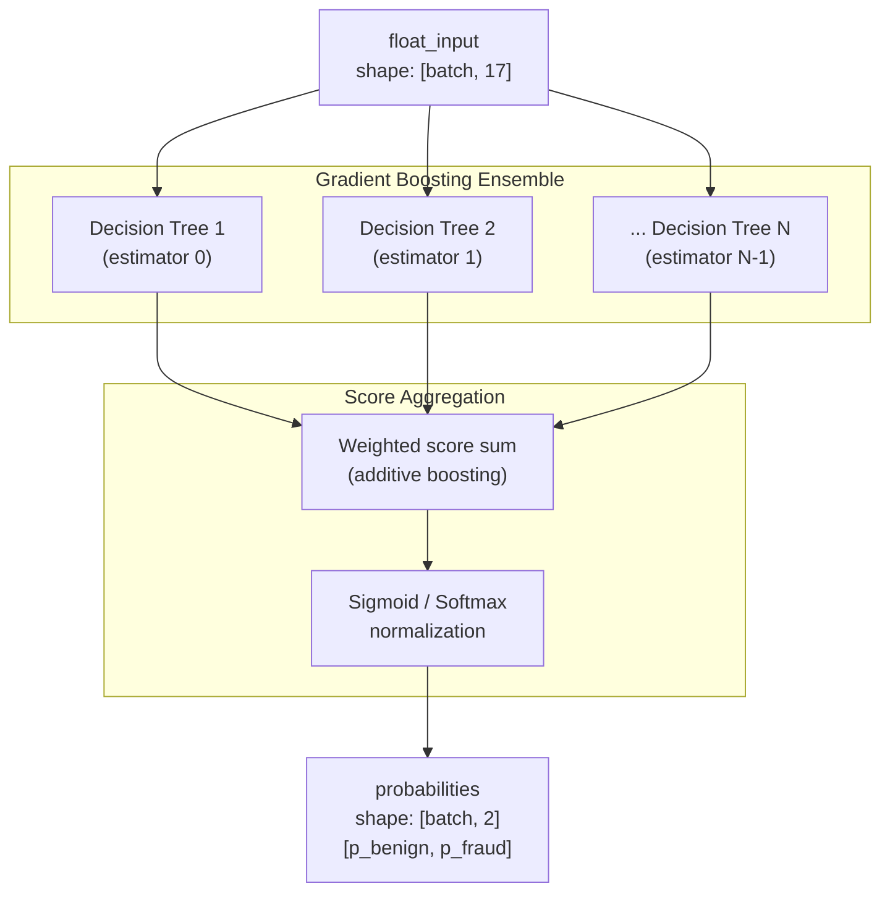

### 2.5 Session Pool and Concurrency Model

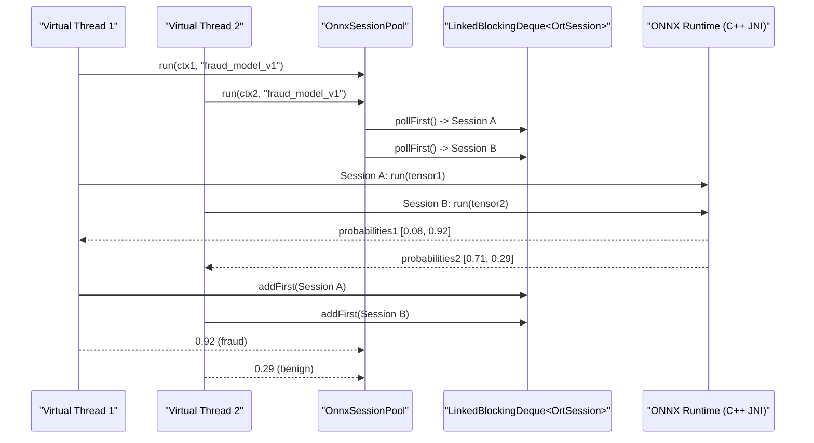

**Key properties:**
- Each `OrtSession` is native C++ state allocated via JNI. Sharing sessions across threads is unsafe.
- `LinkedBlockingDeque` provides O(1) lock-free lease/return under normal (non-contended) conditions.
- Under contention, threads block up to 500 ms for a session before throwing `IllegalStateException`.
- Session count defaults to `max(4, availableProcessors())` and scales linearly with virtual thread count.

---

## 3. Model 2: `ast_reorder_policy.onnx` - Neural AST Reordering Policy

### 3.1 Purpose and Use Case

`ast_reorder_policy` is a Reinforcement Learning (RL) policy network trained to optimize the
evaluation order of AST clauses in boolean AND chains. It learns from observed cost and failure
statistics to produce clause permutations that minimize expected total evaluation cost for a
given workload distribution.

Unlike the analytical `RatioSortPolicy` (which sorts by `C_i / F_i` independently per clause),
the neural policy encodes the joint interaction between all candidate clauses in a single
forward pass and can model non-linear interdependencies between clause ordering decisions.

**Representative use cases:**
- Rules with many interacting AND clauses where pair-wise ratio sort is suboptimal
- Non-stationary traffic distributions where the optimal ordering shifts over time
- Multi-tenant environments where different rule sets share a pool and benefit from learned routing

### 3.2 Observation Vector Schema

The policy network receives an 82-dimensional float observation vector encoding the statistics
of up to 20 candidate clauses. If a rule has fewer than 20 clauses, the remaining slots are
zero-padded.

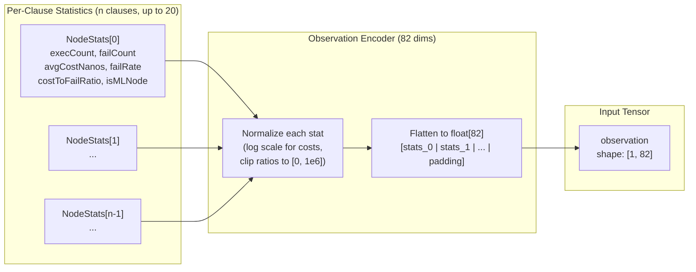

The 82 dimensions break down as: `20 candidate slots x 4 features per slot + 2 global context features`.

Each per-clause slot contains:
- `normalized_cost`: log-scaled average cost in nanoseconds
- `failure_rate`: empirical failure rate in `[0.0, 1.0]`
- `ratio`: normalized cost-to-failure ratio
- `is_ml_node`: 1.0 if clause is an `OnnxInferenceNode`, else 0.0

### 3.3 Network Architecture and Inference Path

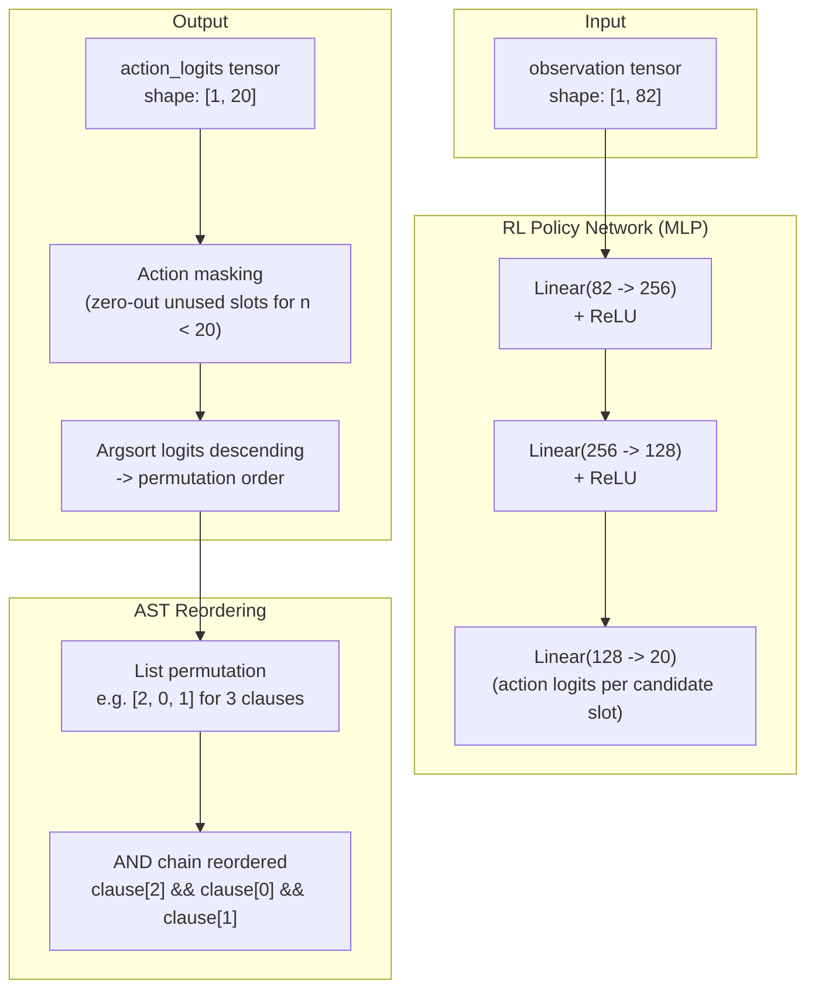

### 3.4 Complete Neural Reordering Pipeline

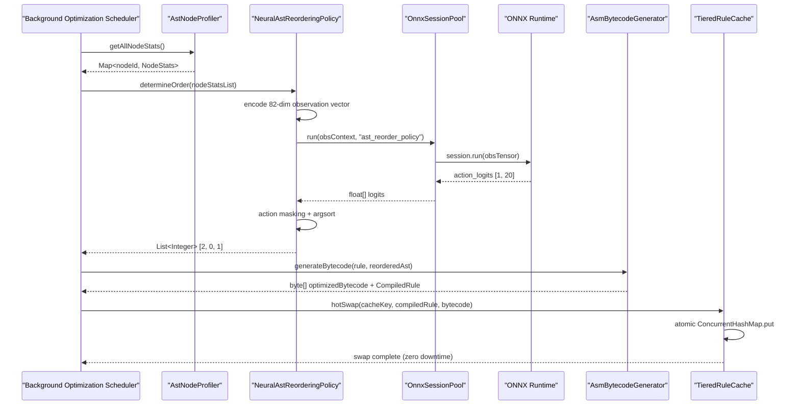

### 3.5 Fallback to RatioSortPolicy

The neural policy degrades gracefully under all failure conditions:

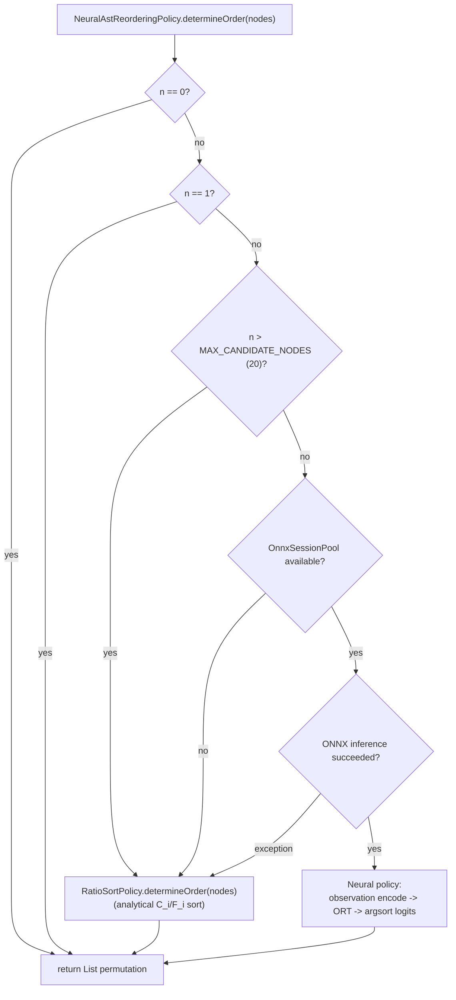

---

## 4. Shared Infrastructure: OnnxSessionPool as a Multi-Model Broker

Both models are served through the same `OnnxSessionPool` instance with per-model independent
session pools backed by `ConcurrentHashMap<modelName, LinkedBlockingDeque<OrtSession>>`.

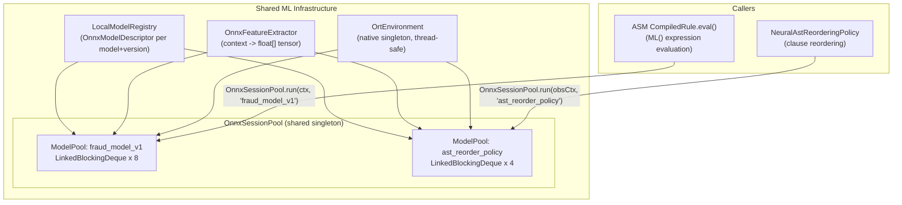

### Pool Isolation Properties

| Property | `fraud_model_v1` Pool | `ast_reorder_policy` Pool |
|---|---|---|
| Caller | ASM-generated `CompiledRule.eval()` (hot path) | `NeuralAstReorderingPolicy` (background scheduler) |
| Session count default | `max(4, CPU count)` | `max(4, CPU count)` (separate pool) |
| Call frequency | Per rule evaluation request (very high throughput) | Per optimization cycle (periodic, low frequency) |
| Input shape | `[1, 17]` float | `[1, 82]` float |
| Output shape | `[1, 2]` float (class probabilities) | `[1, 20]` float (action logits) |
| Output extraction | `outputIndex=1` (fraud probability) | `outputIndex=0` (full logit array) |

---

## 5. End-to-End Request Lifecycle: Fraud Detection with Adaptive Optimization

This diagram traces a single payment transaction through the complete dual-model pipeline
from inbound request to final ALLOW/BLOCK decision, showing how both models interact.

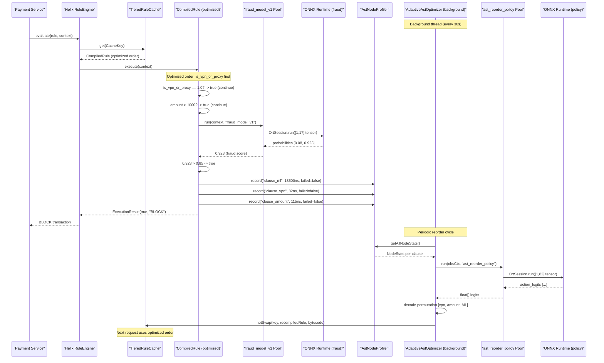

---

## 6. Compilation Pipeline Integration: ML() in the AST

This diagram shows how `ML('fraud_model_v1')` flows through the full compilation pipeline
from expression parsing to native JVM bytecode emission.

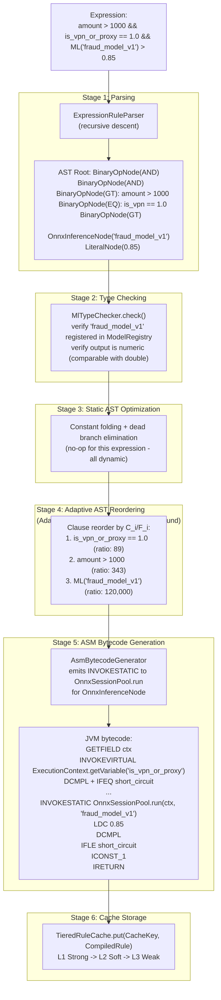

---

## 7. Performance and Latency Characteristics

### Fraud Model Inference

| Metric | In-Process ONNX | Simulated External REST |
|---|---|---|
| Mean latency | 18.9 us | 15,102 us |
| P50 latency | ~15 us | ~14,000 us |
| P90 latency | ~25 us | ~16,000 us |
| P99 latency | 164.8 us | ~18,000 us |
| Speedup | 1x | ~800x slower |
| Network hops | 0 | Serialize + HTTP + Deserialize |
| JVM heap bytes | Shared context reference | Allocation per request |

### Adaptive Reordering Impact

| Metric | Unoptimized (ML first) | Adaptively Optimized (ML last) |
|---|---|---|
| Mean latency (95% benign) | 22.7 us | 1.5 us |
| P99 latency | ~190 us | ~12 us |
| Throughput | 59,000 ops/sec | 730,000 ops/sec |
| Relative improvement | baseline | 93.4% latency reduction, 12.4x throughput |

The fundamental reason for this improvement: 95% of transactions are benign and have
`is_vpn_or_proxy == 0.0`. When placed first, this 80 ns predicate short-circuits the entire
AND chain — the 18,000 ns fraud model inference is never invoked for 95% of requests.

---

## 8. Related Documentation

- [ONNX Model Inference](../core-guides/onnx-model-inference) - ML() grammar reference, OnnxSessionPool configuration, and Python export workflow.
- [Adaptive AST Optimizer](../core-guides/adaptive-ast-optimizer) - Cost-to-failure theory, ReorderingPolicy SPI, and hot-swap mechanism.
- [Compilation Pipeline](compilation-pipeline) - Full 5-stage rule compilation from JSON DSL to JVM bytecode.
- [Flamegraph Profiling](../core-guides/flamegraph-profiling) - JFR-based node-level profiling for measuring per-clause cost distributions.
- [Performance Tuning](../performance-tuning/continuous-benchmarking) - JMH benchmark results for OnnxInferenceBenchmark and AdaptiveOptimizerBenchmark.
- [Helix Cortex Model Registry REST API](../helix-cortex/api-and-telemetry#machine-learning-model-registry-rest-api-apiv1models) - Enterprise ONNX model lifecycle management, version activation, and Redis cluster hot-swap.
