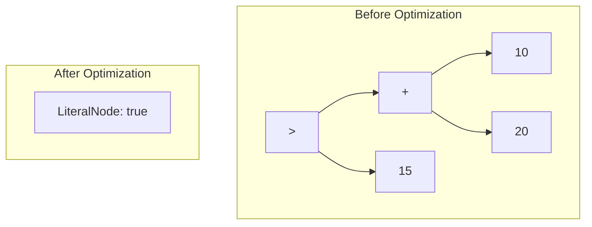

# AST Optimizations & Transformations

Before emitting bytecode, the `BytecodeOptimizer` executes iterative passes across the syntax tree to simplify expressions, prune dead branches, and pre-calculate compile-time invariants.

---

## 1. Constant Folding

Sub-expressions consisting exclusively of literal values and deterministic operators are computed at compile time:



**Result:** Rather than generating bytecode instructions for `BIPUSH 10`, `BIPUSH 20`, `IADD`, and comparison, Helix emits a single opcode: `ICONST_1` (`true`).

---

## 2. Dead Branch Elimination & Short-Circuiting

When logical operators encounter known compile-time boolean values:

| Unoptimized Expression | Optimized AST Result | Rationale |
|---|---|---|
| `true && expr` | `expr` | Identity rule for AND |
| `false && expr` | `false` | Annihilator for AND; `expr` is never evaluated |
| `false || expr` | `expr` | Identity rule for OR |
| `true || expr` | `true` | Annihilator for OR; `expr` is never evaluated |
| `!(!expr)` | `expr` | Double negation cancellation |

---

## 3. Algebraic Identity Simplifications

- `x + 0` -> `x`
- `x * 1` -> `x`
- `x * 0` -> `0`
- `x - 0` -> `x`

---

## Multi-Pass Convergence Loop

The optimizer executes successive passes until no further node replacements occur:

```java
public ASTNode optimize(ASTNode root) {
    ASTNode current = root;
    boolean changed;
    int pass = 0;
    
    do {
        pass++;
        OptimizationResult result = applyPass(current);
        current = result.getNode();
        changed = result.isModified();
    } while (changed && pass < MAX_OPTIMIZATION_PASSES);

    log.debug("AST optimization converged in pass {}", pass);
    return current;
}
```
