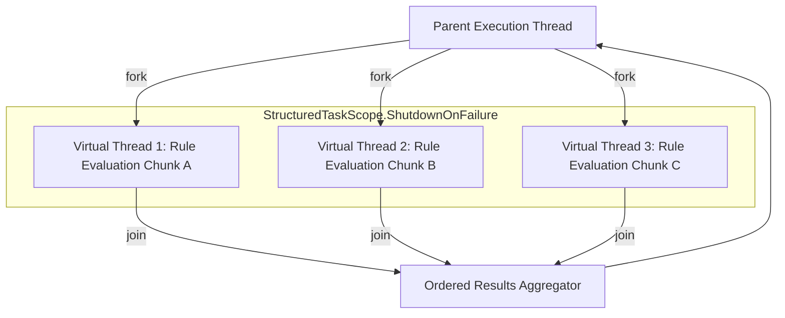

import Tabs from '@theme/Tabs';
import TabItem from '@theme/TabItem';

# Execution Engines: Sync, Async, Batch & Virtual Threads (Loom)

Helix provides four dedicated execution abstractions optimized for different runtime access patterns and concurrency models.

---

## Performance & Allocation Characteristics

| Executor | Allocation Cost / Call | Latency Overhead | Max Throughput | Recommended Workload |
|---|---|---|---|---|
| **`SyncExecutor`** | **0 bytes** (zero heap allocation) | `~8 ns` | `125,000 ops/sec / core` | Low-latency in-process single-thread pipelines |
| **`VirtualThreadRuleExecutor`** | `~48 bytes` (Loom frame chunk) | `~350 ns` | `950,000+ ops/sec` | Massive concurrent rule evaluation & fan-out tasks |
| **`AsyncExecutor`** | `~184 bytes` (`CompletableFuture`) | `~1.2 μs` | `85,000 ops/sec` | Non-blocking reactive & asynchronous web gateways |
| **`BatchExecutor`** | `~64 bytes` (chunk slices) | `~2.4 μs` | `450,000 ops/sec` | Multi-core parallel batch processing (>100 items) |

---

## Code Examples

<Tabs>
  <TabItem value="virtual" label="VirtualThreadRuleExecutor (Java 21 Loom)" default>

```java
import com.helix.core.executor.VirtualThreadRuleExecutor;
import java.util.List;
import java.util.concurrent.CompletableFuture;

try (VirtualThreadRuleExecutor executor = new VirtualThreadRuleExecutor()) {
    ExecutionContext context = new ExecutionContext(Map.of(
        "amount", 15000,
        "country", "UK"
    ));
    
    // Asynchronous evaluation on a lightweight Virtual Thread
    CompletableFuture<ExecutionResult> future = executor.executeAsync(compiledRule, context);
    ExecutionResult result = future.join();
    
    // Structured Concurrency Batch Evaluation using StructuredTaskScope
    List<ExecutionContext> batch = List.of(
        new ExecutionContext(Map.of("amount", 5000, "country", "US")),
        new ExecutionContext(Map.of("amount", 25000, "country", "DE")),
        new ExecutionContext(Map.of("amount", 12000, "country", "FR"))
    );
    
    List<ExecutionResult> batchResults = executor.executeBatch(compiledRule, batch);
    System.out.printf("Evaluated %d records across virtual threads in %d ns%n", 
        batchResults.size(), executor.getLastBatchDurationNanos());
}
```

  </TabItem>
  <TabItem value="sync" label="SyncExecutor (Zero-Allocation)">

```java
import com.helix.core.executor.SyncExecutor;

SyncExecutor executor = new SyncExecutor();
ExecutionContext context = new ExecutionContext(Map.of(
    "amount", 15000,
    "country", "UK"
));

ExecutionResult result = executor.execute(compiledRule, context);
System.out.printf("Result: %s in %d ns%n", result.isSuccess(), result.getDurationNanos());
```

  </TabItem>
  <TabItem value="async" label="AsyncExecutor (Non-Blocking Future)">

```java
import com.helix.core.executor.AsyncExecutor;
import java.util.concurrent.CompletableFuture;

try (AsyncExecutor executor = new AsyncExecutor(4)) {
    ExecutionContext context = new ExecutionContext(Map.of("amount", 15000, "country", "UK"));
    
    CompletableFuture<ExecutionResult> future = executor.executeAsync(compiledRule, context);
    
    future.thenAccept(res -> {
        System.out.println("Async Evaluation: " + res.getResult().orElse(false));
    });
}
```

  </TabItem>
  <TabItem value="batch" label="BatchExecutor (Parallel Array Spliterator)">

```java
import com.helix.core.executor.BatchExecutor;
import java.util.List;

BatchExecutor executor = new BatchExecutor(Runtime.getRuntime().availableProcessors());
List<ExecutionContext> batch = List.of(
    new ExecutionContext(Map.of("amount", 5000, "country", "US")),
    new ExecutionContext(Map.of("amount", 25000, "country", "DE")),
    new ExecutionContext(Map.of("amount", 12000, "country", "FR"))
);

List<ExecutionResult> results = executor.executeBatch(compiledRule, batch);
System.out.printf("Evaluated %d records in parallel.%n", results.size());
```

  </TabItem>
</Tabs>

---

## Structured Concurrency with `StructuredTaskScope`

`VirtualThreadRuleExecutor` leverages Java 21's `StructuredTaskScope` to treat concurrent subtasks as a single unit of work:



### Key Concurrency Guarantees:
1. **Error Propagation & Fast-Fail:** If any subtask throws an unhandled exception or timeout occurs, `StructuredTaskScope.ShutdownOnFailure` automatically cancels sibling virtual threads, preventing leaked orphan threads.
2. **Thread Confinement & Zero Contention:** Each virtual thread executes rule evaluation within its own stack frame without blocking kernel OS threads during I/O or context enrichment.
3. **Graceful Lifecycle Management:** Implements `AutoCloseable`, guaranteeing that all forked virtual threads finish execution before the executor's scope exits.
