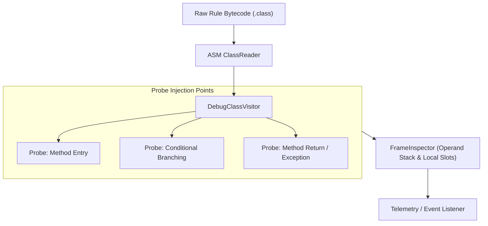

# Interactive REPL & Bytecode Debugging

Helix provides an interactive terminal REPL and dynamic bytecode instrumentation framework powered by **JLine 3** and **ASM**. Engineers can author rules dynamically, inspect AST node graphs, disassemble generated bytecode into raw JVM opcodes, and inject non-intrusive debug probes.

---

## 1. Interactive Terminal REPL

The REPL environment provides an instant feedback loop for prototyping business rules, verifying boolean algebra reductions, and testing rules against sample context dictionaries.

### Launching the Shell

```bash
./scripts/start-helix.sh repl
```

```text
================================================================================
  HELIX JVM ENGINE - INTERACTIVE TERMINAL REPL (v1.0.0)
  Type :help for a list of commands, or :quit to exit.
================================================================================

helix> 
```

### REPL Commands Reference

| Command | Arguments | Description |
|---|---|---|
| `:help` | None | Displays the list of available commands and usage hints. |
| `:load` | `<filePath>` | Reads, validates, and compiles a JSON rule definition from disk. |
| `:eval` | `<jsonContext>` | Evaluates the currently loaded rule against a JSON context object. |
| `:disasm` | None | Disassembles the loaded rule's compiled `.class` bytecode into human-readable opcodes. |
| `:ast` | None | Pretty-prints the Abstract Syntax Tree (AST) before and after optimization. |
| `:history`| None | Lists previously entered REPL commands. |
| `:clear` | None | Clears the terminal screen buffer. |
| `:quit` | None | Exits the interactive shell session. |

---

## 2. Bytecode Disassembly in the REPL

When developing complex nested predicates, verifying that the compiler generates compact, inlining-friendly bytecode is essential. The `:disasm` command decodes the in-memory class bytes:

```text
helix> :load examples/rules/fraud-detection.json
[INFO] Compiled FraudDetectionRule (v1.0.0) in 1.42ms using ASM generator.

helix> :disasm
// Class: com.helix.generated.FraudDetectionRule_v1
// Implements: com.helix.api.CompiledRule
// Minor version: 0, Major version: 65 (Java 21)

public boolean eval(com.helix.api.ExecutionContext);
  Code:
     0: aload_1
     1: ldc           #14 // String amount
     3: invokevirtual #20 // Method ExecutionContext.getInt:(Ljava/lang/String;)I
     6: ldc           #21 // int 10000
     8: if_icmple     24
    11: ldc           #23 // String US
    13: aload_1
    14: ldc           #25 // String country
    16: invokevirtual #28 // Method ExecutionContext.getString:(Ljava/lang/String;)Ljava/lang/String;
    19: invokevirtual #34 // Method String.equals:(Ljava/lang/Object;)Z
    22: ifne          28
    25: iconst_1
    26: ireturn
    27: iconst_0
    28: ireturn
```

:::tip Mechanical Sympathy
Notice that operand stack depth is kept to a minimum (2 slots) and no temporary wrapper objects (`Integer`, `Boolean`) are allocated on the heap, ensuring HotSpot C2 compiler inlines the method unconditionally.
:::

---

## 3. ASM Dynamic Debug Instrumentation & Probing

For running production environments, attaching a heavy debugger (JDWP) can stall threads and skew latency benchmarks. Helix features non-intrusive bytecode probe injection via `DebugClassVisitor` and `FrameInspector`.



### Programmatic Dynamic Probing

```java
import com.helix.core.debug.DebugProbe;
import com.helix.core.debug.FrameInspector;
import com.helix.core.debug.DebugClassVisitor;

// Attach a non-intrusive probe callback
DebugProbe probe = new DebugProbe() {
    @Override
    public void onMethodEnter(String className, String methodName, FrameInspector frame) {
        System.out.printf("[PROBE] Entering %s.%s with %d local variables%n",
            className, methodName, frame.getLocalVariableCount());
    }

    @Override
    public void onBranch(int opcode, boolean taken, FrameInspector frame) {
        System.out.printf("[PROBE] Branch opcode %d evaluation: taken=%b, topOfStack=%s%n",
            opcode, taken, frame.peekOperandStack());
    }

    @Override
    public void onMethodExit(String className, String methodName, Object returnValue, long durationNs) {
        System.out.printf("[PROBE] Exit %s.%s -> return=%s (took %d ns)%n",
            className, methodName, returnValue, durationNs);
    }
};

// Instrument compiled rule bytes dynamically
byte[] instrumentedBytecode = DebugClassVisitor.instrument(compiledRuleBytes, probe);
```

### `FrameInspector` Capabilities:
- **Local Variable Inspection:** Inspects variable names, slots, types (`int`, `long`, `double`, `reference`), and current values without throwing reflection exceptions.
- **Operand Stack Snapshot:** Captures the current depth and top-of-stack operand value at branch instructions.
- **Zero-Halting Overhead:** Executes inline callback hooks in sub-microsecond time without thread suspends.
