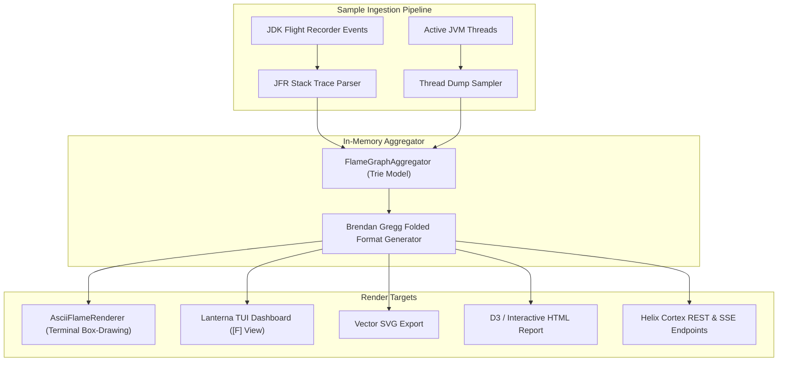

# Folded Stack Profiling & In-Terminal Flame Graphs

Helix features an in-memory folded stack trace aggregator and real-time terminal flame graph visualizer. By converting call stack samples into the standard Brendan Gregg folded format, Helix enables CPU execution time and heap allocation profiling directly in ANSI terminals, Lanterna dashboards, vector SVGs, and interactive HTML.

---

## 1. Architecture of `FlameGraphAggregator`

The aggregator captures stack traces from running execution threads or ingests JDK Flight Recorder (JFR) recording events:



---

## 2. Brendan Gregg Folded Stack Trace Format

The aggregator collapses recurring call paths into single-line representations where semicolon-delimited method frames end with a cumulative sample count:

```text
com.helix.cli.HelixApplication.main;com.helix.cli.command.ExecuteCommand.call;com.helix.core.executor.SyncExecutor.execute 1450
com.helix.cli.HelixApplication.main;com.helix.cli.command.ExecuteCommand.call;com.helix.core.executor.VirtualThreadRuleExecutor.executeBatch 4200
com.helix.cli.HelixApplication.main;com.helix.core.RuleCompiler.compile;com.helix.core.ast.AstOptimizer.optimize 890
```

### Profiling Dimensions
- **`CPU` (Execution Time):** Samples represent on-CPU execution time and thread scheduling ticks.
- **`ALLOC` (Heap Allocations):** Samples represent total memory allocation volume in bytes or allocation count per stack trace.

---

## 3. Terminal Unicode ASCII Flame Graph Rendering

The `AsciiFlameRenderer` formats folded stack aggregations into hierarchical Unicode box-drawing visualizers directly in your terminal console:

```text
┌─ HELIX JVM ENGINE - REAL-TIME FLAME GRAPH (CPU SAMPLES) ───────────────────────┐
│                                                                                │
│  [100.0%] com.helix.cli.HelixApplication.main                                  │
│  ├── [74.2%] com.helix.core.executor.VirtualThreadRuleExecutor.executeBatch    │
│  │   ├── [48.1%] com.helix.generated.FraudRule_v1.eval                        │
│  │   │   ├── [32.4%] com.helix.api.ExecutionContext.getInt                     │
│  │   │   └── [15.7%] com.helix.api.ExecutionContext.getString                  │
│  │   └── [26.1%] java.util.concurrent.StructuredTaskScope.join                 │
│  └── [25.8%] com.helix.core.RuleCompiler.compile                               │
│      ├── [18.2%] com.helix.core.generator.AsmRuleGenerator.generate            │
│      └── [7.6%]  com.helix.core.ast.AstOptimizer.optimize                     │
│                                                                                │
├────────────────────────────────────────────────────────────────────────────────┤
│ Total: 5,650 samples (100.0%) | Depth: 4 | Dimension: CPU | Filter: NONE       │
└────────────────────────────────────────────────────────────────────────────────┘
```

---

## 4. Interactive Lanterna TUI Flame Graph Navigation

When launching the TUI dashboard via `./scripts/start-helix.sh profile --tui`, pressing **`F`** opens the full-screen interactive flame graph browser:

### Keyboard Navigation:
- **`Up` / `Down` Arrow Keys:** Move selection between parent and child stack frames.
- **`Enter`:** Zoom into the selected frame, making it the root of the visualization.
- **`Backspace`:** Zoom out to the previous parent level.
- **`/` (Slash):** Open search box to highlight or filter frames matching a pattern (e.g., `com.helix.generated`).
- **`E`:** Export the currently rendered flame graph view to SVG or HTML on disk.
- **`Esc` or `F`:** Return to the primary JVM system dashboard.

---

## 5. Programmatic Aggregator API

Integrate folded stack aggregation and ASCII flame graph rendering in your application:

```java
import com.helix.profiler.flamegraph.FlameGraphAggregator;
import com.helix.profiler.flamegraph.AsciiFlameRenderer;
import java.io.File;

// Initialize aggregator for CPU execution samples
FlameGraphAggregator aggregator = new FlameGraphAggregator();

// Add folded stack sample paths directly
aggregator.addSample("org.app.Service.handle;com.helix.api.CompiledRule.eval", 1250);
aggregator.addSample("org.app.Service.handle;com.helix.core.cache.TieredRuleCache.get", 450);

// Render Unicode ASCII flame graph to terminal
String asciiOutput = AsciiFlameRenderer.render(aggregator.getRootNode(), 120);
System.out.println(asciiOutput);

// Export vector SVG to disk
File svgFile = new File("target/flamegraphs/helix-profile.svg");
aggregator.exportSvg(svgFile);

// Export interactive HTML flame graph
File htmlFile = new File("target/flamegraphs/helix-profile.html");
aggregator.exportHtml(htmlFile);
```
