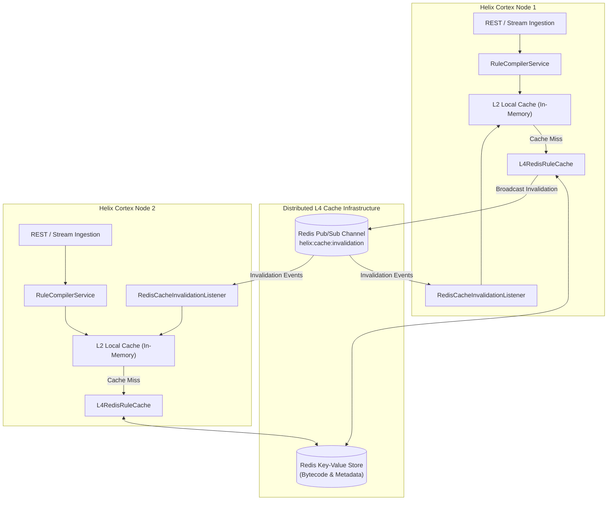

# Redis L4 Distributed Cache & Cluster Invalidation

Helix Cortex extends the Helix rule execution engine with an **L4 Distributed Cache** layer powered by Redis. While L1 (interpreter memoization), L2 (in-memory Caffeine), and L3 (off-heap direct memory) caches optimize node-local execution, the L4 cache allows clustered Helix Cortex nodes to share compiled rule bytecode, eliminate duplicate compilation latency, and synchronize rule updates in real time via Redis Pub/Sub invalidations.

---

## 1. Multi-Tier Cache Architecture



---

## 2. Distributed Bytecode Caching & Key Strategy

When a dynamic rule expression is compiled:
1. `RuleCompilerService` computes the unique cache key based on the rule name and optional version:
   `helix:rule:{ruleName}:{version}`
2. If present in Redis, the precompiled bytecode is retrieved, validated against SHA-256 integrity hashes, and defined into the local isolated classloader without re-running AST optimization or ASM/ByteBuddy code generation.
3. If absent (cache miss), the rule is compiled locally, and the generated bytecode is published to Redis with a configurable Time-To-Live (TTL, default: 86,400 seconds / 24 hours).

---

## 3. Real-Time Cluster Invalidation via Pub/Sub

When a rule is modified or revoked, stale bytecode must not remain active on any node in the cluster.

1. **Broadcast Invalidation:**
   A caller invokes `POST /api/v1/cache/l4/invalidate` or calls `L4CacheService.invalidate(ruleName)`.
   The `RedisCacheInvalidator` issues a Redis `PUBLISH` message to the `helix:cache:invalidation` channel with the rule identifier (or `__ALL__` for complete cache purge).

2. **Cluster Subscriber:**
   Each Helix Cortex instance maintains a background Project Loom virtual thread running `RedisCacheInvalidationListener`. Upon receiving an invalidation event, each node immediately evicts the rule from:
   - Redis L4 key-value cache
   - Node-local compiled rule caches (`RuleCompilerService` and `RuleSessionControl`)

---

## 4. Resilient Local Fallback

If Redis becomes temporarily unreachable, network partitions occur, or connection pools are exhausted:
- `L4RedisRuleCache` automatically switches to local in-memory fallback mode without throwing exceptions or blocking rule execution.
- Telemetry metrics reflect `fallbackActive: true` and `connected: false`.
- Once Redis connectivity is restored, operations resume distributed synchronization seamlessly.

---

## 5. Configuration Reference

Configure Redis connection properties in `microprofile-config.properties` or environment variables:

| Property | Default Value | Description |
| :--- | :--- | :--- |
| `helix.cortex.cache.redis.host` | `localhost` | Redis server hostname or container name |
| `helix.cortex.cache.redis.port` | `6379` | Redis TCP port |
| `helix.cortex.cache.redis.timeout` | `2000` | Socket and connection timeout in milliseconds |
| `helix.cortex.cache.redis.ttl-seconds` | `86400` | Expiration time for cached rule bytecode |
| `helix.cortex.cache.redis.fallback-enabled` | `true` | Fall back to local compilation if Redis is offline |
| `helix.cortex.cache.redis.pool.max-total` | `32` | Maximum connections in the Jedis connection pool |

---

## 6. REST Management & Observability Endpoints

All cache management endpoints require MicroProfile JWT authentication with `ADMIN` or `OPERATOR` roles.

### Inspect Cache Telemetry
```http
GET /api/v1/cache/l4/metrics
Authorization: Bearer <jwt-token>
```

**Response (200 OK):**
```json
{
  "hitCount": 1842,
  "missCount": 35,
  "connected": true,
  "hitRatio": 0.9813,
  "fallbackActive": false,
  "host": "redis",
  "port": 6379
}
```

### Invalidate Specific Rule
```http
POST /api/v1/cache/l4/invalidate
Authorization: Bearer <jwt-token>
Content-Type: application/json

{
  "ruleName": "HighValueTransactionRule",
  "version": "1.0.0"
}
```

**Response (200 OK):**
```json
{
  "ruleName": "HighValueTransactionRule",
  "version": "1.0.0",
  "invalidated": true,
  "broadcast": true,
  "message": "Rule HighValueTransactionRule cache invalidated and broadcast across cluster"
}
```
