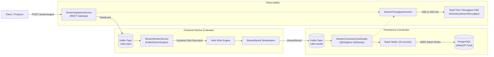

# Distributed Streaming Ingestion & Real-Time Telemetry

Helix Cortex provides an enterprise-grade distributed streaming gateway that decouples high-throughput event ingestion from rule execution and relational audit persistence. Leveraging Apache Kafka (in KRaft mode), Project Loom virtual threads, PostgreSQL JDBC batching, and Server-Sent Events (SSE), Cortex achieves sustained throughput exceeding 10,000+ events per second with zero dropped records.

---

## 1. End-to-End Pipeline Architecture



---

## 2. Ingestion REST Gateway

Events are submitted over HTTP and rapidly acknowledged with HTTP `202 Accepted` once enqueued into the Kafka producer client accumulator buffer.

### Ingest Single Event
```http
POST /api/v1/stream/ingest
Authorization: Bearer <jwt-token>
Content-Type: application/json

{
  "eventId": "evt-order-9841",
  "topic": "rules.input",
  "ruleName": "HighValueTransactionRule",
  "variables": {
    "amount": 25000.0,
    "country": "US",
    "currency": "USD"
  },
  "headers": {
    "client-ip": "10.0.1.42",
    "channel": "mobile"
  }
}
```

**Response (202 Accepted):**
```json
{
  "eventId": "evt-order-9841",
  "topic": "rules.input",
  "ruleName": "HighValueTransactionRule",
  "status": "ACCEPTED",
  "timestamp": 1726776800000
}
```

### High-Throughput Batch Ingestion
Submit hundreds of events in a single HTTP request via `POST /api/v1/stream/ingest/batch`.

---

## 3. Clustered Worker Evaluation

The `StreamWorkerService` embeds `KafkaStreamEngine` to process records from partitioned input topics:
- Decodes incoming binary payloads into `RuleEvent` objects.
- Evaluates registered bytecode-compiled rules against event context variables.
- Emits a structured `StreamResult` (containing status, return value, error detail, and execution latency) to the output topic (`rules.results`).

---

## 4. Background Persistence Coordinator & JDBC Batching

The `@Singleton @Startup` bean `StreamConsumerCoordinator`:
1. Continuously polls evaluation results from `rules.results` on a dedicated virtual thread.
2. Maps each result to `StreamExecutionRecord` and child `StreamRecordMetric` JPA entities.
3. Buffers entities up to the configured batch size (`helix.cortex.kafka.batch-size=25`).
4. Executes batched JDBC writes into PostgreSQL via `StreamExecutionRepository.saveBatch()`, flushing and clearing the persistence context periodically to keep memory footprint flat and maintain HikariCP connection pool stability.
5. Commits Kafka consumer offsets only after database persistence succeeds.

---

## 5. Real-Time SSE Throughput Telemetry

Connect any SSE-compatible client (browser `EventSource`, curl, or monitoring agent) to receive continuous live throughput metrics every 1,000 ms:

```http
GET /api/v1/telemetry/stream/throughput
Authorization: Bearer <jwt-token>
Accept: text/event-stream
```

**Live Event Stream Output:**
```text
event: throughput
id: 1726776801000
data: {"eventsPerSecond":12450.5,"queueDepth":12,"p99LatencyMs":1.85,"totalIngested":50000,"totalConsumed":49988,"totalPersisted":49988,"timestamp":"2026-09-19T18:13:21Z"}

event: throughput
id: 1726776802000
data: {"eventsPerSecond":13120.0,"queueDepth":5,"p99LatencyMs":1.72,"totalIngested":63120,"totalConsumed":63115,"totalPersisted":63115,"timestamp":"2026-09-19T18:13:22Z"}
```

---

## 6. Docker Compose Multi-Node Stack

To run the complete clustered 5-service stack locally:

```bash
docker compose up -d
```

### Orchestrated Services:
- `postgres`: PostgreSQL 16 Alpine with `pg_isready` healthcheck.
- `redis`: Redis 7 Alpine with memory persistence and ping healthcheck.
- `kafka`: Apache Kafka 3.7.0 in KRaft mode (no ZooKeeper required).
- `helix-cortex-1`: Primary WildFly runtime instance on port `8080`.
- `helix-cortex-2`: Secondary clustered WildFly runtime instance on port `8081`.

### Health Check Verification
```bash
docker compose ps
```
All 5 services boot cleanly and report healthy status within seconds.
