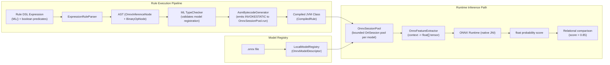
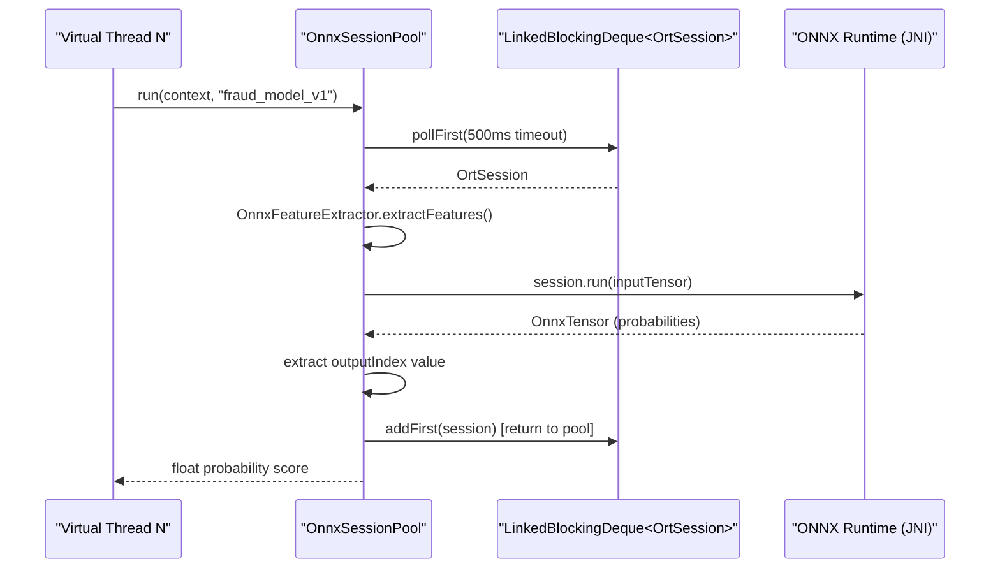
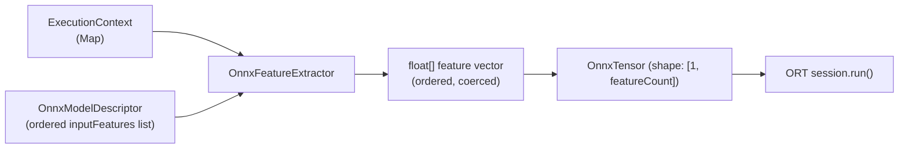

# ONNX Model Inference

Helix enables production-grade in-process machine learning inference by embedding ONNX Runtime as a native JVM library.
Rather than calling external REST inference endpoints (which impose serialization, network, and deserialization overhead),
Helix evaluates ONNX models directly inside the rule execution JVM process with inference latencies in the range of tens of microseconds.

ML inference calls are expressed as first-class grammar constructs in the Helix rule expression language,
participate in short-circuit evaluation alongside conventional boolean predicates, and are compiled
to native JVM bytecode by the ASM bytecode generator.

---

## 1. Architecture Overview



---

## 2. ML() Syntax Grammar Reference

The `ML()` function is a native expression type recognized by the Helix parser.
It resolves to a `float` probability score in the range `[0.0, 1.0]` and may appear anywhere
a numeric value is valid in a rule expression.

### Syntax Forms

```text
ML('model_name') > threshold
ML(model_name)   > threshold
```

Both single-quoted and unquoted model names are supported. The parser produces an `OnnxInferenceNode`
with the specified model name, resolved at type-checking time against the active `ModelRegistry`.

### Grammar Integration Examples

```text
// Fraud detection: ML score combined with cheap predicate guards
amount > 1000 && ML('fraud_model_v1') > 0.85

// Short-circuit ordering: cheap predicates evaluate first by default
is_vpn_or_proxy == 1.0 && amount > 500 && ML('fraud_model_v1') > 0.80

// Nested logical composition
(ML('credit_risk_v2') > 0.70 || previous_chargeback > 3) && account_age_days < 90

// Multi-model evaluation
ML('fraud_model_v1') > 0.85 && ML('device_risk_v1') > 0.60
```

### JSON Rule Schema with ML()

```json
{
  "name": "HighValueFraudRule",
  "version": "1.0.0",
  "expression": "amount > 1000 && is_vpn_or_proxy == 1.0 && ML('fraud_model_v1') > 0.85",
  "inputSchema": {
    "amount": "double",
    "is_vpn_or_proxy": "double",
    "hour_of_day": "double",
    "day_of_week": "double",
    "merchant_category": "double",
    "transaction_currency": "double",
    "velocity_1h": "double",
    "velocity_24h": "double",
    "velocity_7d": "double",
    "amount_deviation_30d": "double",
    "unique_merchants_24h": "double",
    "is_new_device": "double",
    "device_risk_score": "double",
    "country_mismatch": "double",
    "account_age_days": "double",
    "is_account_suspended": "double",
    "previous_chargeback": "double"
  }
}
```

> [!NOTE]
> The `inputSchema` must include all features declared in the `OnnxModelDescriptor.inputFeatures()` list.
> Missing features cause an `IllegalArgumentException` at runtime during feature extraction.

### Operator Compatibility

| Left-hand operand | Operator | Right-hand operand | Result |
|---|---|---|---|
| `ML('model')` | `>` | `double literal` | `boolean` |
| `ML('model')` | `>=` | `double literal` | `boolean` |
| `ML('model')` | `<` | `double literal` | `boolean` |
| `ML('model')` | `<=` | `double literal` | `boolean` |
| `ML('model')` | `==` | `double literal` | `boolean` |
| `ML('model')` | `!=` | `double literal` | `boolean` |

---

## 3. Data Science Export Workflow: Python to ONNX

Helix consumes standard ONNX files exported from any compatible ML training framework.
The recommended export workflow for production fraud or risk models is:

### Step 1: Train and Export a Scikit-learn Model

```python
import numpy as np
from sklearn.ensemble import GradientBoostingClassifier
from sklearn.pipeline import Pipeline
from sklearn.preprocessing import StandardScaler
import skl2onnx
from skl2onnx import convert_sklearn
from skl2onnx.common.data_types import FloatTensorType

# Define input feature ordering (must match OnnxModelDescriptor.inputFeatures)
FEATURE_NAMES = [
    "amount", "hour_of_day", "day_of_week", "merchant_category",
    "transaction_currency", "velocity_1h", "velocity_24h", "velocity_7d",
    "amount_deviation_30d", "unique_merchants_24h", "is_new_device",
    "device_risk_score", "is_vpn_or_proxy", "country_mismatch",
    "account_age_days", "is_account_suspended", "previous_chargeback"
]

# Train model (X_train: shape [n_samples, len(FEATURE_NAMES)])
pipeline = Pipeline([
    ("scaler", StandardScaler()),
    ("clf", GradientBoostingClassifier(n_estimators=100, max_depth=5)),
])
pipeline.fit(X_train, y_train)

# Export to ONNX
initial_types = [("float_input", FloatTensorType([None, len(FEATURE_NAMES)]))]
onnx_model = convert_sklearn(pipeline, initial_types=initial_types, target_opset=15)

with open("fraud_model_v1.onnx", "wb") as f:
    f.write(onnx_model.SerializeToString())
```

### Step 2: Export a PyTorch Model

```python
import torch
import torch.nn as nn

class FraudMLP(nn.Module):
    def __init__(self, input_dim: int):
        super().__init__()
        self.net = nn.Sequential(
            nn.Linear(input_dim, 64), nn.ReLU(),
            nn.Linear(64, 32), nn.ReLU(),
            nn.Linear(32, 2),
            nn.Softmax(dim=1)
        )

    def forward(self, x):
        return self.net(x)

model = FraudMLP(input_dim=17)
# ... training loop ...

dummy_input = torch.randn(1, 17)
torch.onnx.export(
    model,
    dummy_input,
    "fraud_model_v1.onnx",
    input_names=["float_input"],
    output_names=["probabilities"],
    dynamic_axes={"float_input": {0: "batch_size"}, "probabilities": {0: "batch_size"}},
    opset_version=15
)
```

### Step 3: Verify ONNX Graph Outputs

Helix reads the output tensor at a specific index. Verify the output node structure:

```python
import onnx
import onnxruntime as rt

model = onnx.load("fraud_model_v1.onnx")
print([o.name for o in model.graph.output])
# Expected: ['probabilities']
# Index 0 = class probabilities, shape [batch, 2] for binary classification
# index 1 in OnnxModelDescriptor = fraud probability (positive class)

sess = rt.InferenceSession("fraud_model_v1.onnx")
pred = sess.run(["probabilities"], {"float_input": np.random.randn(1, 17).astype(np.float32)})
print(pred[0])  # [[0.12, 0.88]] -> fraud probability = 0.88
```

> [!TIP]
> Use `opset_version=15` or higher for maximum compatibility with ONNX Runtime 1.16+.
> Binary classification models should output a `probabilities` tensor of shape `[batch, 2]`
> where index `1` is the positive class probability referenced by `OnnxModelDescriptor.outputIndex`.

---

## 4. Model Registration with OnnxModelDescriptor

Before a rule referencing `ML('model_name')` can be compiled or executed,
the model must be registered in the active `ModelRegistry`.

### OnnxModelDescriptor Fields

| Field | Type | Description |
|---|---|---|
| `modelName` | `String` | Unique model identifier. Must match the name used in `ML('...')` expressions. |
| `version` | `String` | Semantic version (`major.minor.patch`). Used for active version selection. |
| `modelPath` | `String` | Absolute filesystem path to the `.onnx` model file. |
| `inputFeatures` | `List<String>` | Ordered list of input feature names. Must match execution context variable names. |
| `outputTensorName` | `String` | Name of the ONNX output tensor to read. |
| `outputIndex` | `int` | Index within the output tensor. For binary classification, `1` yields the positive class probability. |
| `active` | `boolean` | Whether this version is the currently active version for the model name. |

### Programmatic Registration

```java
OnnxModelDescriptor descriptor = OnnxModelDescriptor.builder()
    .modelName("fraud_model_v1")
    .version("1.0.0")
    .modelPath("/opt/helix/models/fraud_model_v1.onnx")
    .inputFeatures(List.of(
        "amount", "hour_of_day", "day_of_week", "merchant_category",
        "transaction_currency", "velocity_1h", "velocity_24h", "velocity_7d",
        "amount_deviation_30d", "unique_merchants_24h", "is_new_device",
        "device_risk_score", "is_vpn_or_proxy", "country_mismatch",
        "account_age_days", "is_account_suspended", "previous_chargeback"
    ))
    .outputTensorName("probabilities")
    .outputIndex(1)
    .active(true)
    .build();

LocalModelRegistry registry = new LocalModelRegistry();
registry.registerModel(descriptor);

OnnxSessionPool pool = new OnnxSessionPool(registry);
```

### Classpath-Bundled Models

ONNX model files may be bundled directly inside a module's `src/main/resources/models/` directory
and loaded via the classloader at startup:

```java
URL modelUrl = getClass().getResource("/models/fraud_model_v1.onnx");
String modelPath = new File(modelUrl.getFile()).getAbsolutePath();
```

---

## 5. OnnxSessionPool Concurrency Configuration

`OnnxSessionPool` maintains a fixed-size bounded pool of native `OrtSession` instances per registered model.
Sessions are pre-warmed at pool construction time and leased to inference callers with a timeout.

### Pool Sizing

```java
// Auto-sizing: max(4, availableProcessors)
OnnxSessionPool pool = new OnnxSessionPool(registry);

// Explicit pool size per model
OnnxSessionPool pool = new OnnxSessionPool(registry, 16);
```

### Concurrency Architecture



### Session Lease Configuration

| Parameter | Default | Description |
|---|---|---|
| `maxSessionsPerModel` | `max(4, CPU count)` | Maximum number of concurrent `OrtSession` instances per model. Increase for high virtual thread counts. |
| Session lease timeout | `500 ms` | Duration to wait for an available session before throwing `IllegalStateException`. |

### Tuning for High Concurrency

```java
// Size pool to match expected concurrency level
int concurrency = 32; // target virtual threads
OnnxSessionPool pool = new OnnxSessionPool(registry, concurrency);
```

> [!IMPORTANT]
> ONNX Runtime native sessions are not thread-safe individually. The pool's `LinkedBlockingDeque`
> guarantees that each session is used by at most one thread at a time. Do NOT share `OrtSession`
> instances across threads directly.

---

## 6. Feature Extraction Pipeline

`OnnxFeatureExtractor` bridges the Helix `ExecutionContext` (a `Map<String, Object>`) and the
native ONNX tensor format required by the inference runtime.



### Type Coercion Rules

| Java Type in Context | Coerced to `float` |
|---|---|
| `Double` / `double` | Direct cast |
| `Integer` / `int` | `(float) intValue` |
| `Long` / `long` | `(float) longValue` |
| `Float` / `float` | Identity |
| `Boolean` / `boolean` | `true -> 1.0f`, `false -> 0.0f` |
| `null` | `IllegalArgumentException` |

---

## 7. Model Lifecycle and Hot-Reload

The `LocalModelRegistry` supports multiple registered versions of the same model name.
Activating a new version replaces the active descriptor without restarting the pool.

```java
// Register v2 alongside v1
OnnxModelDescriptor v2 = OnnxModelDescriptor.builder()
    .modelName("fraud_model_v1")
    .version("2.0.0")
    .modelPath("/opt/helix/models/fraud_model_v2.onnx")
    // ... features, tensor config ...
    .active(false)
    .build();

registry.registerModel(v2);

// Atomically switch active version - new inference calls use v2
registry.setActiveVersion("fraud_model_v1", "2.0.0");
```

> [!WARNING]
> Model hot-reload replaces the active descriptor. Existing borrowed sessions from the old
> model version complete normally. The pool drains old sessions and pre-warms new sessions
> on the next inference request cycle.

---

## 8. CLI Compilation and Execution

Compile and execute a rule with an ML() call directly from the Helix CLI:

```bash
# Compile a rule containing ML() to bytecode
helix compile --rule rule.json

# Execute a rule against a context with ML() evaluation
helix execute --rule rule.json --context context.json
```

```json title="context.json"
{
  "amount": 2500.0,
  "hour_of_day": 2.0,
  "day_of_week": 4.0,
  "merchant_category": 3.0,
  "transaction_currency": 2.0,
  "velocity_1h": 5.0,
  "velocity_24h": 20.0,
  "velocity_7d": 65.0,
  "amount_deviation_30d": 2.09,
  "unique_merchants_24h": 9.0,
  "is_new_device": 1.0,
  "device_risk_score": 0.43,
  "is_vpn_or_proxy": 1.0,
  "country_mismatch": 1.0,
  "account_age_days": 86.0,
  "is_account_suspended": 0.0,
  "previous_chargeback": 0.0
}
```

---

## 9. Performance Benchmarks

JMH microbenchmarks ([`OnnxInferenceBenchmark`](../performance-tuning/continuous-benchmarking)) measure end-to-end single-row inline
inference latency versus a simulated external REST call:

| Metric | Inline ONNX (in-process) | Simulated REST (network round-trip) |
|---|---|---|
| Mean latency | 18.9 us | 15,102 us |
| P99 latency | 164.8 us | ~16,000 us |
| Speedup factor | 1x (baseline) | ~800x slower |
| Network hops | 0 | Serialize -> HTTP -> Deserialize |

The inline execution path eliminates all network overhead by evaluating the ONNX model natively
in the same JVM heap as the rule executor, sharing the `ExecutionContext` without any serialization.

---

## 10. Related Guides

- [AST Optimizations](ast-optimizations) - Static compile-time AST transformation passes run before codegen.
- [Adaptive AST Optimizer](adaptive-ast-optimizer) - Runtime cost-based clause reordering to push ML() calls to the tail of AND chains.
- [Flamegraph Profiling](flamegraph-profiling) - JFR-backed node-level profiling to measure per-clause execution costs.
- [Rule Syntax and Schemas](rule-syntax-and-schemas) - Full reference for the Helix expression DSL.
- [Helix Cortex Model Registry REST API](../helix-cortex/api-and-telemetry#machine-learning-model-registry-rest-api-apiv1models) - REST API for uploading, versioning, and cluster hot-swapping ONNX models in Helix Cortex.
