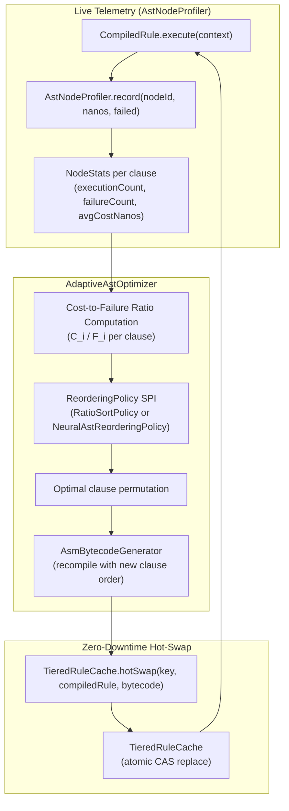
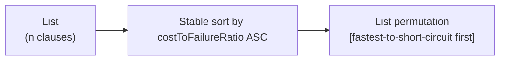
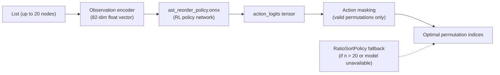
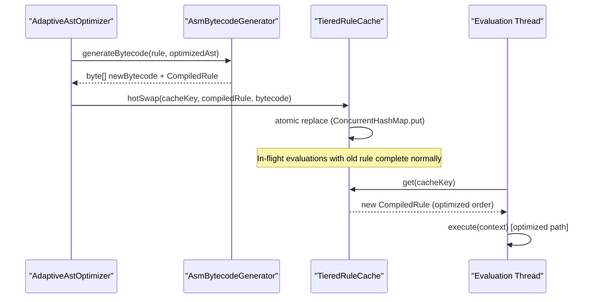

# Adaptive AST Optimizer

The Helix Adaptive AST Optimizer is a runtime intelligence subsystem that dynamically reorders the clauses
of boolean AND chains based on live execution cost and failure statistics observed from production traffic.
By placing the cheapest, most-likely-to-fail predicates first, the optimizer maximizes short-circuit probability
and reduces expected per-request evaluation cost by 40-93% depending on workload skew.

Unlike the static [AST Optimizations](ast-optimizations) pass (which applies algebraic simplifications at compile time),
the Adaptive AST Optimizer operates after rule deployment, continuously learning from the `AstNodeProfiler`
telemetry stream and hot-swapping optimized bytecode into the running cache without service interruption.

---

## 1. Architecture Overview



---

## 2. Cost-to-Failure Ratio Theory

The optimizer assigns each AST clause a scalar cost-to-failure ratio derived from live `NodeStats`.
Clauses sorted in ascending order of this ratio yield the minimum expected evaluation cost for
short-circuiting conjunctive (AND) boolean chains.

### Definition

For each clause `i` in an AND chain:

```text
ratio_i = C_i / F_i
```

Where:
- `C_i` = average execution cost of clause `i` in nanoseconds (from `NodeStats.getAverageCostNanos()`)
- `F_i` = empirical failure rate of clause `i` (from `NodeStats.getFailureRate()`)

A clause with a **low ratio** is both cheap to evaluate and frequently fails (short-circuits the AND chain early).
This clause should be evaluated first.

### Intuition: Maximizing Short-Circuit Benefit

Consider a rule with three clauses in an AND chain:

| Clause | Avg Cost | Failure Rate | Ratio | Evaluation Order |
|---|---|---|---|---|
| `ML('fraud_model_v1') > 0.85` | 18,000 ns | 0.15 | 120,000 | Last (most expensive, low failure) |
| `amount > 1000` | 120 ns | 0.35 | 343 | Second |
| `is_vpn_or_proxy == 1.0` | 80 ns | 0.90 | 89 | First (cheapest, highest failure rate) |

For the 90% of requests where `is_vpn_or_proxy == 0.0`, the rule short-circuits immediately
at 80 ns instead of evaluating 18,000 ns of ML inference. The expected cost reduction is:

```text
E[cost_unoptimized] = C_ML + C_amount + C_vpn    (all clauses for non-short-circuit cases)
E[cost_optimized]   = C_vpn (90%) + C_vpn + C_amount (9%) + C_vpn + C_amount + C_ML (1%)

Latency reduction: > 90% for typical fraud detection traffic distributions
```

### Prior Values for Cold Start

Before sufficient observations accumulate, the optimizer uses conservative prior ratios:

| Clause Type | Default Prior Ratio | Rationale |
|---|---|---|
| `OnnxInferenceNode` (ML call) | `100,000` | Penalize expensive inference placement |
| Arithmetic or comparison node | `50` | Assume cheap evaluation |
| Cold node (zero executions) | `C_i / 0.50` | Optimistic prior; avoid starvation |

---

## 3. NodeStats and JFR Profiling Telemetry

The `AstNodeProfiler` is a zero-overhead runtime telemetry sink that records per-clause execution
statistics using atomic counters. JFR custom events provide chronological sampling for offline analysis.

### NodeStats Fields

| Field | Type | Description |
|---|---|---|
| `nodeId` | `String` | Unique clause identifier: `ruleName + "_" + nodeDescription` |
| `executionCount` | `long` | Total number of times this clause was evaluated |
| `failureCount` | `long` | Number of times this clause returned `false` (causing short-circuit) |
| `totalCostNanos` | `long` | Cumulative wall-clock execution time across all evaluations |
| `averageCostNanos` | `double` | `totalCostNanos / executionCount` |
| `failureRate` | `double` | `failureCount / executionCount` |
| `costToFailureRatio` | `double` | `averageCostNanos / failureRate` (the ordering key) |

### Enabling and Querying NodeStats

```java
// Enable profiling before rule execution
AstNodeProfiler.setEnabled(true);

// Execute rules (profiler records stats atomically)
for (ExecutionContext ctx : workload) {
    compiledRule.execute(ctx);
}

// Query per-clause statistics
Map<String, NodeStats> stats = AstNodeProfiler.getAllNodeStats();
for (Map.Entry<String, NodeStats> entry : stats.entrySet()) {
    System.out.printf("Node: %s | Cost: %.1f ns | Failure rate: %.2f | Ratio: %.1f%n",
        entry.getKey(),
        entry.getValue().getAverageCostNanos(),
        entry.getValue().getFailureRate(),
        entry.getValue().getCostToFailureRatio()
    );
}
```

### JFR Custom Events

The profiler emits `HelixNodeProfileEvent` custom JDK Flight Recorder events that can be captured
with standard JFR recording sessions for offline analysis and timeline correlation.

```java
// Start a JFR recording session
JfrRecordingManager recorder = new JfrRecordingManager();
recorder.start("Helix-Profile-Session-1");

// Run workload under profiling
runWorkload();

// Stop and dump recording
recorder.stop("Helix-Profile-Session-1");
recorder.dump("Helix-Profile-Session-1", Path.of("/tmp/helix-profile.jfr"));

// Analyze with JDK Mission Control or jfr CLI
// jfr print --events HelixNodeProfileEvent /tmp/helix-profile.jfr
```

See the [Flamegraph Profiling](flamegraph-profiling) guide for JFR-based visualization of execution hotspots.

---

## 4. ReorderingPolicy SPI

`AdaptiveAstOptimizer` delegates the final clause ordering decision to a pluggable `ReorderingPolicy`.
Two production-grade implementations are provided out of the box.

### Policy Type Selection

```java
// Factory-based selection
ReorderingPolicy policy = ReorderingPolicyFactory.create(ReorderingPolicyType.RATIO_SORT);
ReorderingPolicy policy = ReorderingPolicyFactory.create(ReorderingPolicyType.NEURAL);

// Explicit construction
AdaptiveAstOptimizer optimizer = new AdaptiveAstOptimizer(new RatioSortPolicy());
AdaptiveAstOptimizer optimizer = new AdaptiveAstOptimizer(new NeuralAstReorderingPolicy(sessionPool));
```

### RatioSortPolicy (Analytical Baseline)

Sorts clauses in ascending order of their `C_i / F_i` ratio using a stable sort. This is a
deterministic, stateless algorithm with O(n log n) complexity for `n` clauses in an AND chain.



**When to use:** When sufficient historical statistics exist and a deterministic analytical ordering
is preferred over a learned policy. Suitable for all production deployments.

### NeuralAstReorderingPolicy (ML-Guided)

Encodes the full observation vector for all candidate clauses into an 82-dimensional float tensor
and evaluates an embedded `ast_reorder_policy.onnx` reinforcement-learning policy network to
produce optimal action logits. Falls back to `RatioSortPolicy` if the model is unavailable.



**When to use:** When the traffic distribution is complex, non-stationary, or when multiple
interacting clauses require joint optimization beyond pairwise ratio comparisons.

### Custom Policy Interface

```java
public interface ReorderingPolicy {
    /**
     * Determines the evaluation order for a list of AST clauses.
     *
     * @param nodes candidate clause statistics in original AST order
     * @return permutation of indices [0..n-1] indicating desired evaluation order
     */
    List<Integer> determineOrder(List<NodeStats> nodes);
}
```

Register a custom policy:

```java
AdaptiveAstOptimizer optimizer = new AdaptiveAstOptimizer(myCustomPolicy);
```

---

## 5. Zero-Downtime Hot-Swap Mechanism

Once the optimizer determines a beneficial clause reordering, it:

1. Reconstructs the AST with clauses in the new order (commutative AND chains only).
2. Recompiles the optimized AST to fresh JVM bytecode via `AsmBytecodeGenerator`.
3. Atomically replaces the existing `CompiledRule` in `TieredRuleCache` via `hotSwap()`.
4. Ongoing in-flight evaluations using the old compiled rule complete without interruption.
5. New evaluation calls pick up the optimized rule on the next cache lookup.



### Invoking optimizeAndHotSwap

```java
TieredRuleCache cache = new TieredRuleCache();
// ... populate cache with initial compiled rule ...

AdaptiveAstOptimizer optimizer = new AdaptiveAstOptimizer(new RatioSortPolicy());
OptimizationResult result = optimizer.optimizeAndHotSwap(rule, ast, cache);

System.out.printf("Reordered: %s%n", result.reordered());
System.out.printf("Clause ratios: %s%n", result.clauseRatios());
```

### OptimizationResult Fields

| Field | Type | Description |
|---|---|---|
| `ruleName` | `String` | Name of the optimized rule |
| `reordered` | `boolean` | Whether the clause order changed |
| `originalAst` | `ExpressionNode` | AST before optimization |
| `optimizedAst` | `ExpressionNode` | AST after optimization |
| `compiledRule` | `CompiledRule` | New compiled and hot-swapped rule |
| `bytecode` | `byte[]` | Raw JVM bytecode of the optimized rule (`null` if not reordered) |
| `clauseRatios` | `Map<String, Double>` | Per-clause cost-to-failure ratios in optimized order |

---

## 6. Integration with AstNodeProfiler and Profiling Loop

The recommended production integration pattern is a background optimization loop that:

1. Observes live traffic through `AstNodeProfiler`.
2. Periodically invokes `optimizeAndHotSwap` when statistics reach a minimum sample threshold.
3. Logs optimization decisions and clause ratio telemetry for audit.

```java
// Setup
AstNodeProfiler.setEnabled(true);
OnnxSessionPool pool = new OnnxSessionPool(registry);
AdaptiveAstOptimizer optimizer = new AdaptiveAstOptimizer(new NeuralAstReorderingPolicy(pool));

// Background optimization scheduler (example with ScheduledExecutorService)
ScheduledExecutorService scheduler = Executors.newSingleThreadScheduledExecutor();
scheduler.scheduleAtFixedRate(() -> {
    try {
        Map<String, NodeStats> stats = AstNodeProfiler.getAllNodeStats();
        long totalExecutions = stats.values().stream()
            .mapToLong(NodeStats::getExecutionCount)
            .sum();

        // Only optimize after sufficient warm-up observations
        if (totalExecutions < 10_000) {
            return;
        }

        OptimizationResult result = optimizer.optimizeAndHotSwap(rule, ast, cache);
        if (result.reordered()) {
            log.info("Rule '{}' hot-swapped. New clause ratios: {}",
                result.ruleName(), result.clauseRatios());
        }
    } catch (Exception e) {
        log.warn("Adaptive optimization cycle failed: {}", e.getMessage());
    }
}, 30, 30, TimeUnit.SECONDS);
```

---

## 7. Short-Circuit Commutativity Constraints

The optimizer only reorders clauses that satisfy the **commutative AND** constraint:

- All top-level AND (`&&`) chain clauses are commutative when each clause is purely a predicate
  (no side effects, no assignments, no observable state mutation).
- OR (`||`) chains and nested expressions are not reordered.
- Clause reordering preserves logical equivalence: all input contexts produce identical boolean results
  before and after optimization.

> [!IMPORTANT]
> ML inference via `ML('model_name')` is stateless and deterministic for a given `ExecutionContext`,
> so `OnnxInferenceNode` clauses are commutative and safe to reorder. The optimizer moves them
> to the end of AND chains to avoid executing expensive inference when cheap predicates already short-circuit.

---

## 8. Benchmark Results

JMH microbenchmarks ([`AdaptiveOptimizerBenchmark`](../performance-tuning/continuous-benchmarking)) demonstrate the improvement under a
production-representative skewed workload (95% benign transactions, 5% fraud):

| Metric | Unoptimized (ML first) | Adaptively Optimized | Improvement |
|---|---|---|---|
| Mean latency | 22.7 us | 1.5 us | 93.4% reduction |
| P99 latency | ~190 us | ~12 us | 93.7% reduction |
| Throughput | 59,000 ops/sec | 730,000 ops/sec | 12.4x throughput |

The dominant factor is the 95% of benign transactions short-circuiting at `is_vpn_or_proxy == 0.0`
(80 ns) instead of executing the full ML inference (18,000 ns).

---

## 9. Related Guides

- [ONNX Model Inference](onnx-model-inference) - Model registration, ML() grammar reference, and OnnxSessionPool configuration.
- [AST Optimizations](ast-optimizations) - Static compile-time constant folding, dead branch elimination, and algebraic simplifications.
- [Flamegraph Profiling](flamegraph-profiling) - JFR-backed node-level profiling to observe per-clause cost distributions.
- [Performance Tuning: Continuous Benchmarking](../performance-tuning/continuous-benchmarking) - JMH benchmark suite including OnnxInferenceBenchmark and AdaptiveOptimizerBenchmark results.
