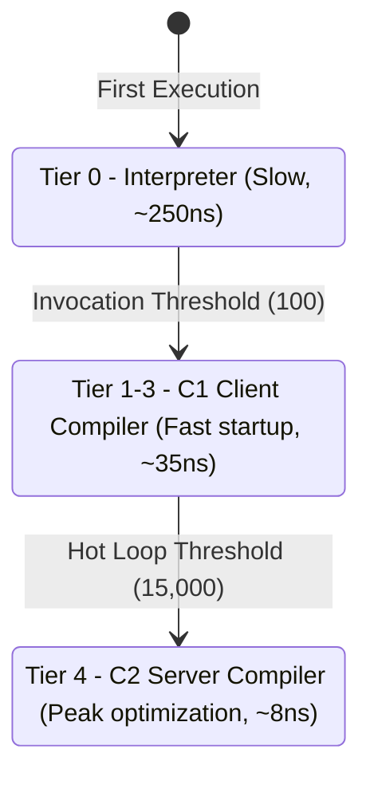

# HotSpot JIT Tiered Compilation & Inlining

The HotSpot JVM employs a multi-tiered JIT compilation strategy to balance fast application startup with peak execution throughput.

---

## Compilation Tier Progression



---

## Method Inlining Threshold Rules

HotSpot makes inlining decisions based on compiled bytecode size:

| Inlining Setting | Bytecode Threshold | Decision Behavior |
|---|---|---|
| `-XX:MaxInlineSize=35` | $\le$ 35 bytes | **Always Inlined** regardless of execution frequency. |
| `-XX:FreqInlineSize=325` | $\le$ 325 bytes | **Inlined** if the method callsite is marked hot by C1 profiling counters. |
| *Large Methods* | $>$ 325 bytes | **Inlining Rejected**. Invocation incurs standard call dispatch overhead. |

---

## Experiment Output Example

```bash
./scripts/start-helix.sh experiment --name jit --output json
```

```json
{
  "experiment" : "JIT",
  "status" : "SUCCESS",
  "scenario" : "HotSpot Tiered Compilation Progression",
  "highestTierAchieved" : "Tier 4 (C2)",
  "inliningDecision" : "Inlined (size <= 35B)"
}
```
