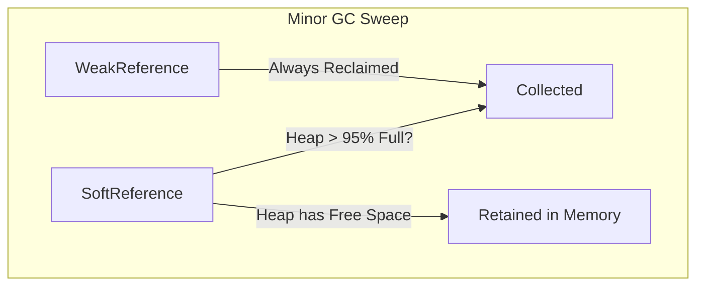

# Garbage Collection Reference Mechanics

This experiment evaluates the lifecycle differences between `SoftReference` (used in L2 Cache) and `WeakReference` (used in L3 Cache) under active memory pressure.

---

## Behavior Comparison



---

## Soft Reference Formula

HotSpot uses the `-XX:SoftRefLRUPolicyMSPerMB` JVM flag (default `1000`) to determine when soft references expire:

```text
Time to Clear (ms) = Free Heap Space (MB) * SoftRefLRUPolicyMSPerMB
```

For example, with **4,096 MB (4 GB)** of free heap memory and default policy (1000 ms/MB), soft references survive for **~4,096 seconds (~68 minutes)** before being candidates for eviction.

---

## Experiment Output Example

```bash
./scripts/run-experiment.sh gc
```

```text
[INFO] Running GC Stress Experiment...
WeakReference Scenario: Initial = 10, Cleared = 10, Retained = 0
SoftReference Scenario: Initial = 10, Cleared = 0, Retained = 10 (Sufficient Heap Available)
```
