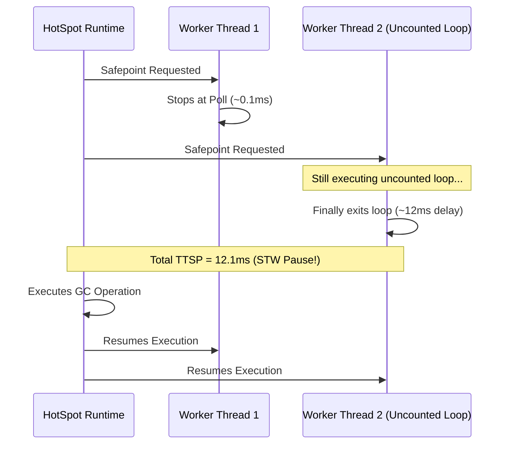

# JVM Safepoints & Time-To-Safepoint (TTSP)

A **Safepoint** is a JVM-wide state where all application threads pause execution so HotSpot can perform global operations such as GC sweeps, biased lock revocation, or on-stack replacement (OSR).

---

## The TTSP Latency Problem

When a safepoint is requested:
1. The JVM signals all worker threads to reach a safepoint check (usually loop headers or method returns).
2. **Time-To-Safepoint (TTSP)** is the delay between requesting the safepoint and the last thread actually stopping.
3. Uncounted loops (loops without safepoint polls) can cause catastrophic latency spikes (e.g. 100ms+ pause times).



---

## Experiment Output Example

```bash
./scripts/run-experiment.sh safepoint
```

```text
[INFO] Running Safepoint Experiment 'G1CollectForAllocation'...
[INFO] Observed Safepoint Metrics:
       - Time-To-Safepoint (TTSP): 0.450 ms
       - Time At Safepoint:        3.500 ms
       - Total Pause Duration:     3.950 ms
```
