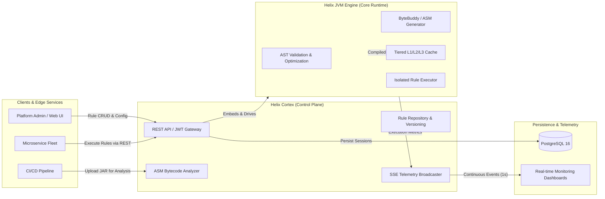

# Helix Cortex: Enterprise Control Plane for Helix Engine

**Helix Cortex** is the enterprise Jakarta EE 10 control plane, distributed API gateway, and real-time observability platform built to operationalize and orchestrate the **Helix JVM Scripting Engine** at scale.

While `helix-jvm-engine` operates as an ultra-low latency, embedded bytecode compilation and rule execution engine, `helix-cortex` provides the centralized governance, multi-tenant persistence, security boundaries, and telemetry streaming required for production enterprise environments.

---

## Why Helix Cortex? Embedded Engine vs. Distributed Control Plane

Modern distributed architectures often require a separation of concerns between raw execution speed and centralized lifecycle management:

| Dimension | Helix JVM Engine (`helix-jvm-engine`) | Helix Cortex (`helix-cortex`) |
| :--- | :--- | :--- |
| **Primary Role** | Dynamic script compilation & low-latency execution | Enterprise API gateway, rule repository & observability hub |
| **Runtime Environment** | Embedded JVM library / CLI / Terminal TUI | Jakarta EE 10 application (WildFly 31 / Docker) |
| **Target Latency** | Sub-microsecond (< 50 ns execution path) | Millisecond REST/SSE network interface |
| **State & Persistence** | In-memory tiered cache (L1/L2/L3) | PostgreSQL with Jakarta Persistence 3.1 & Hibernate |
| **Security Model** | In-process boundary | MicroProfile JWT 2.1 authentication & RBAC |
| **Observability** | JMX MBeans, Lanterna TUI, JMH benchmarks | Server-Sent Events (SSE) stream, OpenAPI 3.0, JSON-P |
| **Bytecode Analysis** | ByteBuddy & ASM generation | ASM ClassReader automated JAR inspection |

---

## Core Capabilities of the Helix Ecosystem

When deployed together, `helix-jvm-engine` and `helix-cortex` unlock key enterprise capabilities:

1. **Centralized Rule Governance**: Business rules and scripts can be authored, versioned, audited, and stored in PostgreSQL through REST APIs without modifying or rebuilding application code.
2. **Dynamic Hot-Compilation**: Rules submitted to Cortex are passed directly to Helix's compilation pipeline, generating high-performance Java bytecode that runs natively on the host JVM.
3. **Automated Bytecode Verification**: Upstream build systems and CI/CD pipelines can submit compiled JARs to Cortex to inspect class hierarchies, methods, and bytecode instructions using ASM before production rollouts.
4. **Real-time Observability**: Subscribing clients receive continuous telemetry updates over HTTP Server-Sent Events (SSE) at 1-second intervals, reporting CPU load, heap consumption, active sessions, and cache hit rates.
5. **Multi-Tenant Security**: MicroProfile JWT 2.1 tokens enforce strict role-based access control (`ADMIN`, `OPERATOR`, `ANALYST`, `DATA_SCIENTIST`, `ENGINEER`) across all rule compilation, execution, and inspection endpoints.
6. **Enterprise Machine Learning Governance**: Centralized REST API for uploading, versioning, and cluster-wide zero-downtime hot-swapping of ONNX models via Redis Pub/Sub, consumable by compiled rules using the native `ML()` expression primitive. See [Model Registry REST API](api-and-telemetry#machine-learning-model-registry-rest-api-apiv1models).
