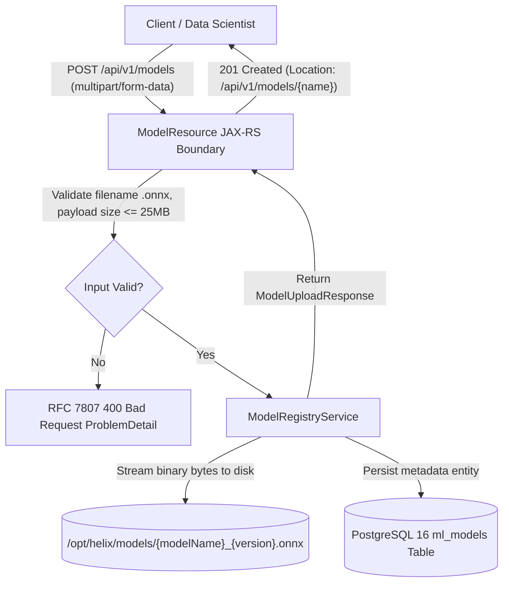
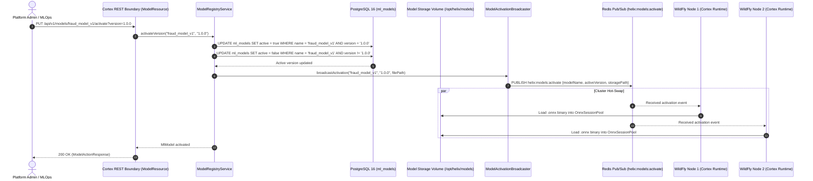

# REST API Reference & Real-Time Telemetry

Helix Cortex exposes a comprehensive Jakarta RESTful Web Services (JAX-RS) API documented via MicroProfile OpenAPI 3.0.

---

## Interactive OpenAPI Documentation

When Helix Cortex is running, the live OpenAPI specification is accessible at:
- **OpenAPI Schema (JSON / YAML)**: `http://localhost:8080/openapi`
- **Application Context**: `http://localhost:8080/helix-cortex/api/v1`

All secured endpoints require the HTTP header:
```http
Authorization: Bearer <jwt-token>
```

---

## Complete API Endpoints Table

| Category | Method | Path | Required Role | Description |
| :--- | :--- | :--- | :--- | :--- |
| **Auth** | `POST` | `/api/v1/auth/login` | Public | Authenticates credentials and returns a signed MicroProfile JWT token. |
| **Auth** | `POST` | `/api/v1/auth/register` | Public | Registers a new user with BCrypt password hashing. |
| **Auth** | `POST` | `/api/v1/auth/refresh` | Authenticated | Exchanges a valid token for a refreshed token. |
| **Rules** | `POST` | `/api/v1/rules/compile` | `ADMIN`, `OPERATOR` | Compiles raw JSON rule syntax into Helix AST and executable bytecode. |
| **Rules** | `POST` | `/api/v1/rules/execute` | `ADMIN`, `OPERATOR` | Evaluates a compiled rule against input context with sub-ms execution. |
| **Rules** | `POST` | `/api/v1/rules/execute/batch` | `ADMIN`, `OPERATOR` | Evaluates a rule against an array of contexts concurrently (Virtual Threads / Pool). |
| **Rules** | `GET` | `/api/v1/rules/sessions` | `ADMIN`, `OPERATOR`, `ANALYST` | Lists all execution sessions (optimized query, single SQL statement). |
| **Rules** | `GET` | `/api/v1/rules/sessions/{id}` | `ADMIN`, `OPERATOR`, `ANALYST` | Retrieves full execution details and metrics for a single session. |
| **Rules** | `DELETE` | `/api/v1/rules/sessions/{id}` | `ADMIN` | Deletes a recorded execution session. |
| **Analysis** | `POST` | `/api/v1/analysis/jar` | `ADMIN`, `OPERATOR` | Uploads a `.jar` archive and inspects bytecode using ASM ClassReader. |
| **Analysis** | `GET` | `/api/v1/analysis/reports` | `ADMIN`, `OPERATOR`, `ANALYST` | Lists summary reports of all historical JAR bytecode inspections. |
| **Analysis** | `GET` | `/api/v1/analysis/reports/{id}` | `ADMIN`, `OPERATOR`, `ANALYST` | Retrieves detailed class and method inspection breakdown for a report. |
| **Telemetry**| `GET` | `/api/v1/telemetry/stream` | `ADMIN`, `OPERATOR`, `ANALYST` | Server-Sent Events (SSE) continuous live telemetry stream (1s interval). |
| **Telemetry**| `GET` | `/api/v1/telemetry/metrics` | `ADMIN`, `OPERATOR`, `ANALYST` | Instantaneous snapshot of engine memory, CPU, and execution metrics. |
| **Telemetry**| `GET` | `/api/v1/telemetry/flamegraph` | `ADMIN`, `OPERATOR`, `ANALYST` | Folded stack traces or SVG/HTML flame graph (`?format=folded\|html\|svg`). |
| **Telemetry**| `GET` | `/api/v1/telemetry/flamegraph/stream` | `ADMIN`, `OPERATOR`, `ANALYST` | Continuous live SSE stream broadcasting updated folded stack traces. |
| **Models**   | `POST` | `/api/v1/models` | `ADMIN`, `DATA_SCIENTIST` | Multipart upload of `.onnx` binary with metadata and database registration. |
| **Models**   | `GET` | `/api/v1/models` | `ADMIN`, `OPERATOR`, `DATA_SCIENTIST`, `ENGINEER` | Lists all registered model families, active version tags, and version counts. |
| **Models**   | `GET` | `/api/v1/models/{name}` | `ADMIN`, `OPERATOR`, `DATA_SCIENTIST`, `ENGINEER` | Retrieves detailed metadata, version history, file sizes, and input schemas for a model. |
| **Models**   | `PUT` | `/api/v1/models/{name}/activate` | `ADMIN` | Activates a specific model version and broadcasts cluster-wide hot-swap event via Redis. |
| **Models**   | `DELETE` | `/api/v1/models/{name}/versions/{version}` | `ADMIN` | Deletes specific model version from database registry and underlying filesystem storage. |

---

## API Usage Examples

### 1. Authenticate & Obtain JWT

```bash
curl -s -X POST http://localhost:8080/helix-cortex/api/v1/auth/login \
  -H "Content-Type: application/json" \
  -d '{"username": "admin", "password": "AdminPassword123!"}'
```

**Response (`200 OK`):**
```json
{
  "token": "eyJhbGciOiJSUzI1NiIs...",
  "expiresIn": 3600,
  "tokenType": "Bearer",
  "username": "admin",
  "roles": ["ADMIN"]
}
```

### 2. Compile a Business Rule

```bash
curl -s -X POST http://localhost:8080/helix-cortex/api/v1/rules/compile \
  -H "Authorization: Bearer $TOKEN" \
  -H "Content-Type: application/json" \
  -d '{
    "ruleName": "fraud-velocity-check",
    "description": "Flags transactions with excessive velocity",
    "expression": "context.transactionCount > 10 && context.amount > 5000"
  }'
```

**Response (`200 OK`):**
```json
{
  "ruleId": "fraud-velocity-check",
  "status": "COMPILED",
  "compilationTimeNs": 124500,
  "cacheTier": "L1",
  "message": "Bytecode successfully compiled and linked"
}
```

### 3. Concurrent Batch Evaluation (Virtual Threads)

Execute thousands of contextual items concurrently across lightweight virtual threads:

```bash
curl -s -X POST http://localhost:8080/helix-cortex/api/v1/rules/execute/batch \
  -H "Authorization: Bearer $TOKEN" \
  -H "Content-Type: application/json" \
  -d '{
    "ruleId": "fraud-velocity-check",
    "contexts": [
      {"transactionCount": 12, "amount": 6000},
      {"transactionCount": 2, "amount": 100},
      {"transactionCount": 15, "amount": 12000}
    ]
  }'
```

**Response (`200 OK`):**
```json
{
  "ruleId": "fraud-velocity-check",
  "totalEvaluated": 3,
  "durationMs": "0.342",
  "executorType": "VIRTUAL_THREADS",
  "results": [
    {"index": 0, "result": true},
    {"index": 1, "result": false},
    {"index": 2, "result": true}
  ]
}
```

### 4. Fetch Folded Stack Flame Graphs

Retrieve folded stack traces or formatted SVG/HTML for enterprise profiling:

```bash
# Get raw Brendan Gregg folded stack traces
curl -s -H "Authorization: Bearer $TOKEN" \
  "http://localhost:8080/helix-cortex/api/v1/telemetry/flamegraph?format=folded&dimension=cpu"

# Get downloadable vector SVG
curl -s -H "Authorization: Bearer $TOKEN" \
  "http://localhost:8080/helix-cortex/api/v1/telemetry/flamegraph?format=svg" -o flamegraph.svg
```

### 5. Stream Real-Time Telemetry & Flame Graphs (SSE)

Clients can subscribe to live performance events or live flame graph updates:

```bash
# Telemetry Stream
curl -N -H "Authorization: Bearer $TOKEN" \
  http://localhost:8080/helix-cortex/api/v1/telemetry/stream

# Live Flame Graph Stream
curl -N -H "Authorization: Bearer $TOKEN" \
  http://localhost:8080/helix-cortex/api/v1/telemetry/flamegraph/stream
```

**Flame Graph Event Stream Output:**
```text
event: flamegraph
data: {"timestamp":1726338420000,"dimension":"CPU","folded":"com.helix.cli.Main;com.helix.core.VirtualThreadRuleExecutor.executeBatch 4200\ncom.helix.cli.Main;com.helix.core.RuleCompiler.compile 890"}
```

---

## Machine Learning Model Registry REST API (/api/v1/models)

Helix Cortex provides an enterprise machine learning model registry enabling data scientists, MLOps engineers, and administrators to upload, inspect, version, hot-swap, and delete ONNX model artifacts used by Helix rules.

When rules contain native `ML(model_name)` invocations, `RuleCompilerService` inspects the AST, resolves the active model version from the registry, extracts feature signatures, and binds native ONNX Runtime sessions without requiring application restarts.

---

### Overview and Role-Based Access Control

All endpoints under `/api/v1/models` require MicroProfile JWT authentication (`Authorization: Bearer <token>`) and enforce fine-grained role-based access control (RBAC):

| Endpoint | Method | Path | Allowed Roles | Description |
|---|---|---|---|---|
| Upload Model | `POST` | `/api/v1/models` | `ADMIN`, `DATA_SCIENTIST` | Uploads `.onnx` binary file and registers version metadata. |
| List Models | `GET` | `/api/v1/models` | `ADMIN`, `OPERATOR`, `DATA_SCIENTIST`, `ENGINEER` | Retrieves catalog summary of all model families and active version tags. |
| Model Details | `GET` | `/api/v1/models/{name}` | `ADMIN`, `OPERATOR`, `DATA_SCIENTIST`, `ENGINEER` | Retrieves comprehensive metadata and complete version history for a model. |
| Activate Version | `PUT` | `/api/v1/models/{name}/activate` | `ADMIN` | Marks target version active and broadcasts cluster hot-swap via Redis. |
| Delete Version | `DELETE` | `/api/v1/models/{name}/versions/{version}` | `ADMIN` | Deletes model version metadata and underlying filesystem binary. |

---

### Model Upload and Registration Architecture

The upload workflow validates the binary payload format and size, stores the artifact in the persistent model volume, and records the entity metadata in PostgreSQL:



---

### Dynamic Model Activation and Cluster Hot-Swap Architecture

When an administrator activates a new model version, Helix Cortex initiates an atomic database update followed by a Redis Pub/Sub broadcast across the cluster, triggering zero-downtime hot-swapping in all running worker nodes:



---

### Comprehensive REST Endpoints Reference

#### 1. Upload ONNX Model Artifact (`POST /api/v1/models`)

Uploads an ONNX model binary along with version metadata using standard `multipart/form-data`.

**Form Fields:**
- `file` (required): Binary `.onnx` file payload. File extension must be `.onnx`.
- `modelName` (required): Unique name identifying the model family (e.g., `fraud_model_v1`).
- `version` (required): Semantic version string (e.g., `1.0.0`).
- `inputSchema` (optional): JSON schema or metadata string defining expected input tensor features.
- `description` (optional): Human-readable description of model weights, architecture, or training run.

**Size Constraint:** Uploaded files cannot exceed the configured maximum size (default: 25 MB / `26,214,400` bytes).

**Curl Example:**
```bash
curl -s -X POST http://localhost:8080/helix-cortex/api/v1/models \
  -H "Authorization: Bearer $TOKEN" \
  -F "file=@fraud_model_v1.onnx;type=application/octet-stream" \
  -F "modelName=fraud_model_v1" \
  -F "version=1.0.0" \
  -F "inputSchema={\"features\":[\"amount\",\"velocity_1h\",\"risk_score\"],\"type\":\"float32\"}" \
  -F "description=Initial production random forest classifier for card-not-present transactions"
```

**Response (`201 Created`):**
```http
HTTP/1.1 201 Created
Location: /api/v1/models/fraud_model_v1
Content-Type: application/json
```
```json
{
  "modelName": "fraud_model_v1",
  "version": "1.0.0",
  "filePath": "/opt/helix/models/fraud_model_v1_1.0.0.onnx",
  "fileSizeKb": 30,
  "active": false,
  "location": "/api/v1/models/fraud_model_v1"
}
```

---

#### 2. List All Registered Models (`GET /api/v1/models`)

Returns a catalog summary of all registered model families, indicating the currently active version, total version count, output tensor type, and active artifact file size.

**Curl Example:**
```bash
curl -s -X GET http://localhost:8080/helix-cortex/api/v1/models \
  -H "Authorization: Bearer $TOKEN"
```

**Response (`200 OK`):**
```json
[
  {
    "modelName": "fraud_model_v1",
    "activeVersion": "1.0.0",
    "versionCount": 2,
    "outputType": "FLOAT",
    "activeFileSizeKb": 30
  },
  {
    "modelName": "ast_reorder_policy",
    "activeVersion": "2.1.0",
    "versionCount": 3,
    "outputType": "FLOAT",
    "activeFileSizeKb": 12
  }
]
```

---

#### 3. Get Model Details & Version History (`GET /api/v1/models/{name}`)

Retrieves complete metadata for a model family, including full version history, upload timestamps, file paths, and input schemas.

**Curl Example:**
```bash
curl -s -X GET http://localhost:8080/helix-cortex/api/v1/models/fraud_model_v1 \
  -H "Authorization: Bearer $TOKEN"
```

**Response (`200 OK`):**
```json
{
  "modelName": "fraud_model_v1",
  "activeVersion": "1.0.0",
  "versionCount": 2,
  "versions": [
    {
      "version": "1.0.0",
      "filePath": "/opt/helix/models/fraud_model_v1_1.0.0.onnx",
      "fileSizeKb": 30,
      "inputSchema": "{\"features\":[\"amount\",\"velocity_1h\",\"risk_score\"],\"type\":\"float32\"}",
      "outputType": "FLOAT",
      "active": true,
      "uploadedBy": "data_science_lead",
      "uploadedAt": "2026-09-23T10:15:30Z",
      "description": "Initial production random forest classifier for card-not-present transactions"
    },
    {
      "version": "0.9.0-rc1",
      "filePath": "/opt/helix/models/fraud_model_v1_0.9.0-rc1.onnx",
      "fileSizeKb": 28,
      "inputSchema": "{\"features\":[\"amount\",\"velocity_1h\",\"risk_score\"],\"type\":\"float32\"}",
      "outputType": "FLOAT",
      "active": false,
      "uploadedBy": "data_science_lead",
      "uploadedAt": "2026-09-20T08:00:00Z",
      "description": "Pre-release experimental weights"
    }
  ]
}
```

---

#### 4. Activate Model Version (`PUT /api/v1/models/{name}/activate?version={version}`)

Promotes a specific model version to active status. This operation:
1. Atomically marks the target version as `active = true` and all other versions of this model as `active = false` in PostgreSQL.
2. Emits a Redis Pub/Sub event on channel `helix:models:activate` with payload `{"modelName":"...","activeVersion":"...","storagePath":"...","timestamp":...}`.
3. Notifies all cluster worker nodes to hot-swap their in-process `OnnxSessionPool` instances to the newly activated model binary.

**Query Parameters:**
- `version` (required): The version string to activate (e.g., `1.0.0`).

**Curl Example:**
```bash
curl -s -X PUT "http://localhost:8080/helix-cortex/api/v1/models/fraud_model_v1/activate?version=1.0.0" \
  -H "Authorization: Bearer $TOKEN"
```

**Response (`200 OK`):**
```json
{
  "status": "SUCCESS",
  "modelName": "fraud_model_v1",
  "version": "1.0.0",
  "message": "Model version activated successfully"
}
```

---

#### 5. Delete Model Version (`DELETE /api/v1/models/{name}/versions/{version}`)

Deletes a specific model version from the database registry and removes the physical `.onnx` binary file from filesystem storage.

**Path Parameters:**
- `name` (required): Model family name.
- `version` (required): Version string to remove.

**Curl Example:**
```bash
curl -s -X DELETE http://localhost:8080/helix-cortex/api/v1/models/fraud_model_v1/versions/0.9.0-rc1 \
  -H "Authorization: Bearer $TOKEN"
```

**Response (`200 OK`):**
```json
{
  "status": "SUCCESS",
  "modelName": "fraud_model_v1",
  "version": "0.9.0-rc1",
  "message": "Model version deleted successfully"
}
```

---

#### 6. Error Handling & RFC 7807 Diagnostics

All model registry endpoints return structured RFC 7807 Problem Details (`application/problem+json`) upon error:

**Validation Failure (`400 Bad Request`):**
```http
HTTP/1.1 400 Bad Request
Content-Type: application/problem+json
```
```json
{
  "status": 400,
  "title": "Bad Request",
  "detail": "Model file must have .onnx extension (received: model.bin)"
}
```

**Payload Limit Exceeded (`400 Bad Request`):**
```json
{
  "status": 400,
  "title": "Bad Request",
  "detail": "Uploaded file size exceeds maximum allowed limit (26214400 bytes)"
}
```

**Entity Not Found (`404 Not Found`):**
```http
HTTP/1.1 404 Not Found
Content-Type: application/problem+json
```
```json
{
  "status": 404,
  "title": "Not Found",
  "detail": "Model 'fraud_model_v1' version '9.9.9' not found"
}
```

**Authorization Failure (`403 Forbidden`):**
```http
HTTP/1.1 403 Forbidden
Content-Type: application/problem+json
```
```json
{
  "status": 403,
  "title": "Forbidden",
  "detail": "Caller does not possess the required role [ADMIN] for model activation"
}
```

---

## Configuration Reference

Configure these properties in `microprofile-config.properties`, container environment variables, or Helm values:

### Concurrency & Telemetry Configuration

| Property | Environment Variable | Default | Description |
|---|---|---|---|
| `helix.cortex.executor.type` | `CORTEX_EXECUTOR_TYPE` | `VIRTUAL_THREADS` | Executor strategy for batch rule evaluation (`VIRTUAL_THREADS` or `PLATFORM_POOL`). |
| `helix.cortex.flamegraph.dimension` | `CORTEX_FLAMEGRAPH_DIMENSION` | `cpu` | Telemetry stack trace profiling dimension (`cpu` or `alloc`). |

### Model Registry & Storage Configuration

| Property | Environment Variable | Default | Description |
|---|---|---|---|
| `helix.models.storage.dir` | `CORTEX_MODELS_STORAGE_DIR` | `/opt/helix/models` | Base filesystem directory for persisted `.onnx` model binary files. |
| `helix.models.redis.topic` | `CORTEX_MODELS_REDIS_TOPIC` | `helix:models:activate` | Redis Pub/Sub channel used to broadcast model version activation events across cluster nodes. |
| `helix.onnx.model.max-size-bytes` | `CORTEX_MODELS_MAX_SIZE_BYTES` | `26214400` | Maximum allowed binary upload size in bytes (default: 25 MB). |

---

## Related Documentation & Cross-Links

- [System Architecture & Integration Flow](architecture-integration) - Architectural overview of Helix Cortex BCE layers and rule compilation pipeline.
- [Deployment, Docker Stack & WildFly Setup](deployment-and-setup) - Containerized multi-node cluster setup with persistent `cortex_models` volume and Redis.
- [Enterprise Use-Cases & Integration Patterns](enterprise-use-cases) - High-throughput fraud prevention and automated rule compilation patterns.
- [ONNX Model Inference Guide](../core-guides/onnx-model-inference) - In-process ONNX Runtime evaluation, `ML()` rule grammar, and session pooling.
- [Adaptive AST Optimizer](../core-guides/adaptive-ast-optimizer) - Cost-to-failure branch reordering and reinforcement learning policy guidance.
- [ML Inference & Adaptive Optimization Architecture](../architecture-and-internals/ml-inference-and-adaptive-optimization) - Deep-dive into model execution, tensor layouts, and RL-guided AST clause reordering.
