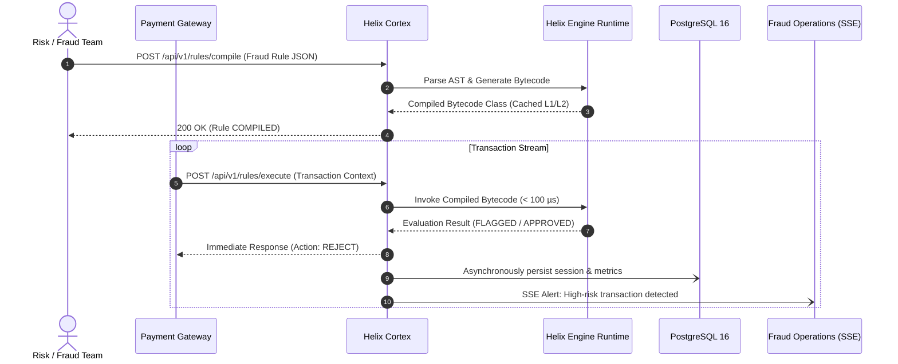
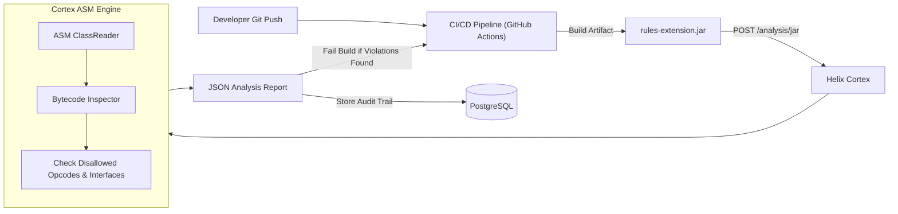
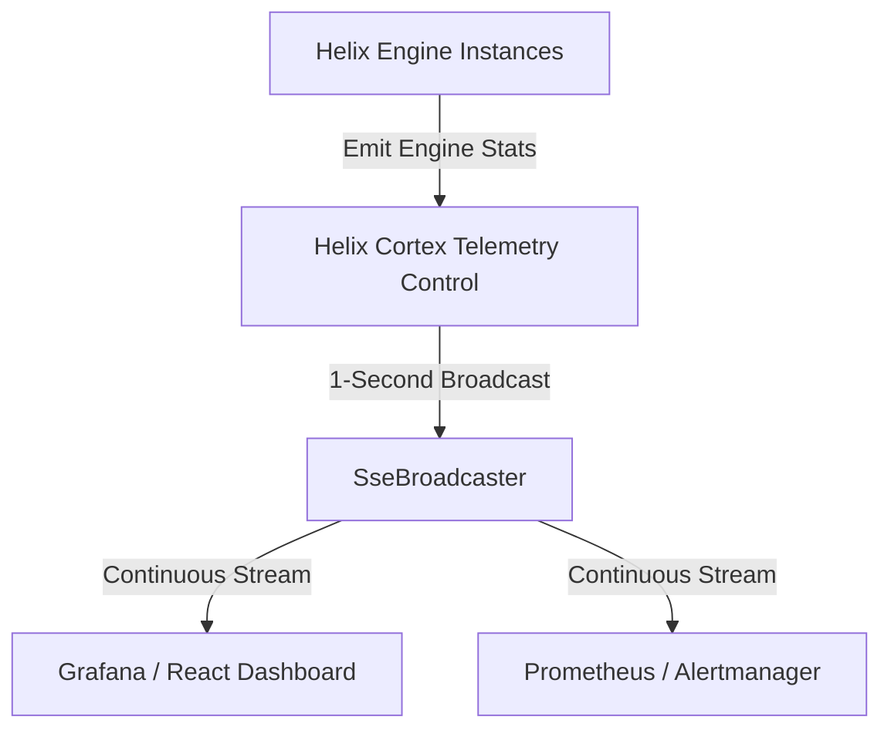

# Enterprise Use-Cases & Integration Patterns

Helix Cortex and the Helix JVM Scripting Engine complement each other to solve complex computational and operational challenges. Below are four production-proven architectural patterns.

---

## Pattern 1: High-Throughput Fraud Prevention in Payment Gateways

### The Challenge
A financial transaction gateway processes over 10,000 transactions per second. Fraud detection predicates (e.g., suspicious IP ranges, velocity spikes, card-not-present limits) must be updated multiple times a day without restarting services or interrupting transaction throughput.

### Solution Architecture


### Concrete Implementation
```bash
# 1. Compile the fraud velocity rule
curl -X POST http://localhost:8080/helix-cortex/api/v1/rules/compile \
  -H "Authorization: Bearer $TOKEN" \
  -H "Content-Type: application/json" \
  -d '{
    "ruleName": "velocity-and-amount-check",
    "expression": "context.velocityPerHour > 5 && context.amountUSD > 1000"
  }'

# 2. Evaluate incoming live transaction
curl -X POST http://localhost:8080/helix-cortex/api/v1/rules/execute \
  -H "Authorization: Bearer $TOKEN" \
  -H "Content-Type: application/json" \
  -d '{
    "ruleName": "velocity-and-amount-check",
    "context": {
      "velocityPerHour": 8,
      "amountUSD": 1450.00,
      "cardCountry": "US"
    }
  }'
```

---

## Pattern 2: Dynamic Pricing & Promotion Engine for E-Commerce

### The Challenge
During flash sales (e.g., Black Friday), marketing teams need to launch and tweak targeted discount rules every 15 minutes based on live inventory and competitor pricing. Evaluating complex nested conditions across millions of shopping carts using interpreted scripting languages (like JavaScript or Groovy) introduces excessive CPU overhead and Metaspace memory leaks.

### How Helix + Cortex Solve It:
1. **Dynamic Bytecode Compilation**: Cortex takes marketing rule expressions and compiles them into native JVM bytecode instructions via Helix's ASM generator.
2. **Classloader Isolation**: Each rule version is loaded into an isolated child classloader. When a rule is replaced, its classloader is dereferenced, allowing the JVM garbage collector to reclaim Metaspace seamlessly.
3. **Sub-Microsecond Execution**: Cached compiled rules execute in nanoseconds, allowing the shopping cart checkout pipeline to evaluate dozens of discounts per item without inflating p99 response times.

---

## Pattern 3: Automated Bytecode Quality & Compatibility Gate (CI/CD)

### The Challenge
Organizations maintaining modular plugin architectures allow different teams to build custom business extensions packed in `.jar` files. Unvetted third-party JARs can introduce dangerous reflection, illegal bytecode instructions, or unoptimized class structures that destabilize production JVMs.

### Solution Architecture


### Concrete Implementation
```bash
# Upload JAR for automated bytecode inspection
curl -X POST http://localhost:8080/helix-cortex/api/v1/analysis/jar \
  -H "Authorization: Bearer $TOKEN" \
  -F "file=@target/rules-extension.jar"
```

**Inspection Response:**
```json
{
  "reportId": "rep-9812",
  "scannedClasses": 14,
  "status": "APPROVED",
  "classes": [
    {
      "className": "com.helix.rules.CustomDiscountCalculator",
      "methodsCount": 4,
      "hasForbiddenReflectOps": false,
      "bytecodeSize": 4120
    }
  ]
}
```

---

## Pattern 4: Centralized Fleet Observability & SRE Dashboards

### The Challenge
Operations and SRE teams running distributed rule engines need immediate visibility into cluster performance:
- Are rules hitting the L1 bytecode cache or triggering expensive recompilations?
- Is the JVM heap growing under heavy rule session loads?
- How many concurrent sessions are currently running across the cluster?

### How Helix + Cortex Solve It:
Instead of polling JMX or database tables (which adds query load), clients subscribe to `GET /api/v1/telemetry/stream`.



Subscribers receive real-time updates every 1,000 milliseconds with zero polling latency, enabling instant detection of cache degradation or memory anomalies.
